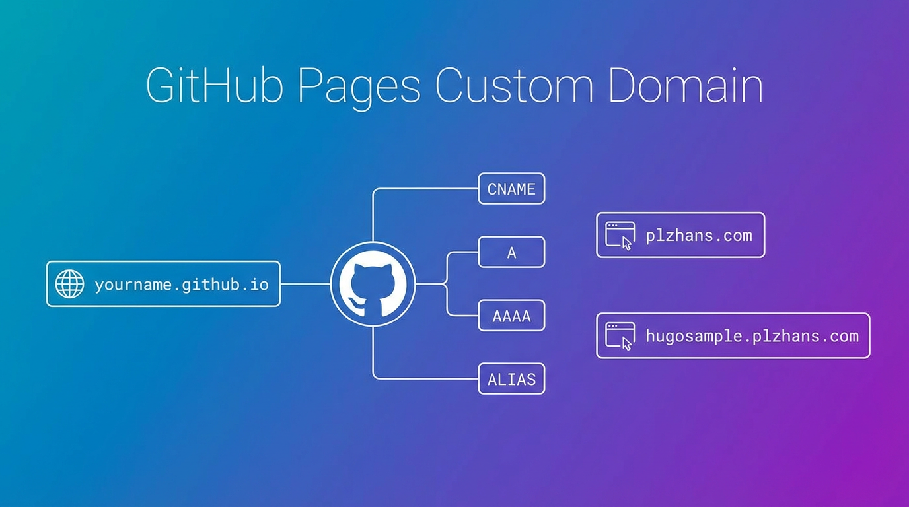
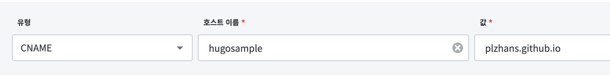
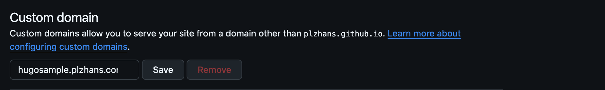

# 概要


GitHub Pagesは基本的に `https://{アカウント名}.`[`github.io/{リポジトリ名}/`](http://github.io/%7B저장소명%7D/) 形式のURLを提供します。


この記事ではカスタムドメインを接続する方法を説明します。


# サブドメインを使用する


`hugosample.plzhans.com` のようなサブドメインを使用する場合です。


## DNS設定


ドメインのDNS設定でCNAMEレコードを追加します。





**設定例**

- Type: CNAME
- Name: サブドメイン(例: hugosample)
- Value: {アカウント名}.[github.io](http://github.io/)

## GitHub Pages設定


Repository → Settings → Pages → Custom domainでカスタムドメインを入力します。


**入力例:** hugosample.plzhans.com





# apexドメインを使用する


`plzhans.com` のようにドメインのルートを使用する場合です。


## apexドメインとは


`www` や `blog` のようなサブドメインを付けないドメイン自体を指します。ルートドメイン、ネイキッドドメイン(naked domain)、zone apexとも呼ばれます。

- Apex: `plzhans.com`
- サブドメイン: `www.plzhans.com`, `blog.plzhans.com`

> 💡 **なぜapexにはCNAMEを使えないのか**  
> サブドメインはCNAME一行で済みますが、apexはIPを直接記載するAレコードを使います。理由はDNS仕様にあります。  
>   
>   
> CNAMEレコードは同じ名前で他のレコードと共存できません。しかしapexには、そのゾーンを誰が管理しているかを示すSOAレコードとNSレコードが必ず存在しなければなりません。結局apexにCNAMEを入れると必須レコードと競合するため、標準に準拠したDNSでは登録自体が拒否されます。  
>   
>   
> GitHub Pagesがサブドメインとは異なり、apexに対してのみ4つのIPを案内しているのもこのためです。  
>   
> <details>  
> <summary>CloudflareではapexにCNAMEが入ります</summary>  
>   
> Cloudflareを使っていてapexにCNAMEを入れたら、そのまま動作したという場合があります。**CNAME Flattening** 機能のおかげです。  
>   
>   
> CloudflareがCNAMEの参照先を代わりに調べて最終的なIPアドレスを見つけ出し、外部からの問い合わせにはCNAMEではなくIPで応答します。設定画面にはCNAMEに見えますが、実際の応答はAレコードなので標準と競合しません。一部の状況ではデフォルトで動作し、そうでない場合は設定でオンにする必要があります。  
>   
>   
> 参考: [Cloudflare CNAME flattening](https://developers.cloudflare.com/dns/cname-flattening/)  
>   
>   
> 他のDNS事業者が提供するALIASまたはANAMEレコードも、同じ問題を解決する似たような方式です。  
>   
>   
> </details>


## DNS設定


DNSプロバイダーによってA、AAAAまたはALIASレコードを設定します。


| レコードタイプ         | Name | Value                                                                           |
| -------------- | ---- | ------------------------------------------------------------------------------- |
| A              | @    | 185.199.108.153<br>185.199.109.153<br>185.199.110.153<br>185.199.111.153                 |
| AAAA           | @    | 2606:50c0:8000::153<br>2606:50c0:8001::153<br>2606:50c0:8002::153<br>2606:50c0:8003::153 |
| ALIASまたはANAME | @    | USERNAME.github.io                                                              |


**参考:** ALIAS/ANAMEレコードに対応していないDNSプロバイダーの場合はAレコードを使用します。


## GitHub Pages設定


Repository → Settings → Pages → Custom domainでカスタムドメインを入力します。


**入力例:** plzhans.com


# HTTPSを有効化する


**Enforce HTTPS** オプションをチェックすると、HTTPS証明書が自動的に適用されます。


> ⚠️ 証明書の発行と伝播には最大24時間かかる場合があります。HTTPS接続ができない場合は、1日ほど待ってから再度お試しください。


# デプロイ方式によるCNAMEファイルの扱い


SettingsでCustom domainを保存すると、GitHubがデプロイソースに `CNAME` ファイルを作成します。このファイルをどう扱うかはデプロイ方式によって異なります。

- **GitHub Actionsのワークフローでデプロイする場合**: `CNAME` ファイルは無視され、必要ありません。Settingsに保存した値がそのまま維持されます。
- **ブランチ(gh-pagesなど)からデプロイする場合**: カスタムドメインはリポジトリの `CNAME` ファイルで管理されます。ビルド成果物でブランチをまるごと上書きするデプロイツールを使うと、このファイルが消えてSettingsのCustom domainがリセットされます。

ブランチデプロイでドメインが繰り返しリセットされる場合は、ビルド成果物に `CNAME` が含まれるようにします。Hugoの場合、`static/CNAME` にドメインを1行入れておくと、ビルドのたびに `public/CNAME` にコピーされます。


```plain text
# hugo/static/CNAME
hugosample.plzhans.com
```


# DNS設定の確認


設定した後、実際にどの値が応答するかを確認します。


```bash
# 서브 도메인 (CNAME)
dig +short hugosample.plzhans.com CNAME

# Apex 도메인 (A)
dig +short plzhans.com A
```


サブドメインは `{アカウント名}.github.io` が返ってくるべきで、apexドメインは先ほど整理したGitHub PagesのIP4つが返ってくるべきです。値が異なる場合はDNSプロバイダーの設定を再確認してください。


# HTTPSが有効化されない場合


Enforce HTTPSのチェックボックスが無効のままの場合は、証明書がまだ発行されていません。


まずCAAレコードを確認します。ドメインでCAAレコードを使用している場合、`letsencrypt.org` を許可する項目が必ず必要です。なければ証明書の発行自体が失敗します。


```bash
dig +short plzhans.com CAA
```


それでも有効化されない場合は、Custom domainを空にして保存した後、再度入力して発行を再試行してください。


# apexとwwwを併用する


`plzhans.com` でアクセスしても `www.plzhans.com` でアクセスしても同じサイトが開くようにする設定です。HTTPSを使用するサイトであれば、両方用意しておくことをお勧めします。


混同しやすいポイントは、<strong>Pages設定画面とDNSに入れる値が異なるという点</strong>です。Custom domain入力欄には1行だけ入力し、もう一方はDNSレコードでのみ接続しておきます。


### 1. Pagesにはapexドメインのみ入力する


Repository → Settings → Pages → Custom domain に `plzhans.com` のみ入力します。`www.plzhans.com` はここに別途入力しません。


### 2. DNSには両方を登録する


| レコードタイプ | Name | Value                                | 受け付けるアクセス                                 |
| ------ | ---- | ------------------------------------ | ------------------------------------------ |
| A      | @    | 先ほど整理したGitHub PagesのIP4つ            | [plzhans.com](http://plzhans.com/)         |
| CNAME  | www  | {アカウント名}.[github.io](http://github.io/) | [www.plzhans.com](http://www.plzhans.com/) |


### 3. リダイレクトはGitHubが自動で行う


上記のように設定すると、`www.plzhans.com` に来たリクエストをGitHubが自動的に `plzhans.com` にリダイレクトします。リダイレクトルールを別途作成する必要はありません。


> ⚠️ `www` のCNAMEレコードを登録しないと、`www` アドレスは接続されません。リダイレクトはDNSがGitHubを指している場合にのみ動作します。


なお、`www.www.plzhans.com` のように `www.www` で始まるドメインは設定できません。


# Hugoを使用する場合のサイトbaseURLの調整


カスタムドメインの接続が終わったら、静的サイトジェネレーターの `baseURL` も同じアドレスに変更する必要があります。値が以前の `github.io` アドレスのままだと、ドメインは開きますがCSSと画像のパスが壊れます。


設定場所については [Hugo + Githubでブログを作る](../94-hugo-github-blog/) の記事を参考にしてください。


---


参考

- [GitHub公式ドキュメント: カスタムドメインの管理](https://docs.github.com/ko/pages/configuring-a-custom-domain-for-your-github-pages-site/managing-a-custom-domain-for-your-github-pages-site)

## 関連記事

- 全体の概観: [Hugoブログを作る - 始め方からSEOまで](../123-hugo-blog-guide/)
- [Hugo + Githubでブログを作る](../94-hugo-github-blog/)
- [hugoサイトの多言語対応](../93-hugo-multilingual-seo-setup/)
