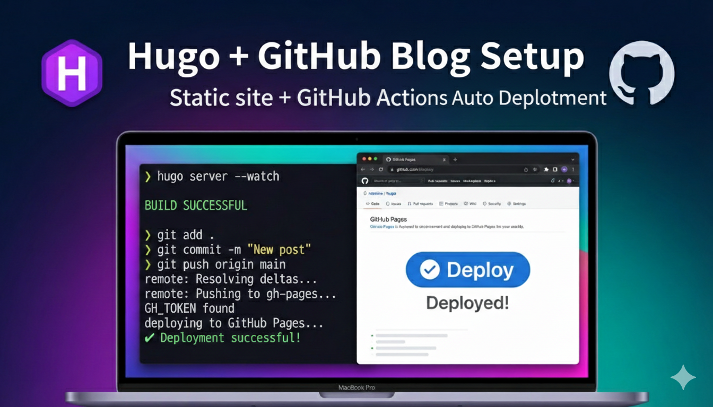

## Introduction


I had been keeping technical notes in Evernote and personal documents, and was preparing to run a blog using Notion's website feature.


However, Notion had limitations on customization, and using a custom domain came with extra costs, which gave me pause.


As an alternative, I considered switching to [velog](https://velog.io/) or rewriting everything in Markdown and moving to Jekyll.


But I couldn't give up Notion, which is so convenient to write in. My conclusion: write in Notion and deploy it as a static website!


## Goals

- Build documents written as md files with Hugo
- Automate deployment with GitHub Pages

> 💡 **Build Environment**  
> - Test environment: Mac  
> - Deployment environment: GitHub Actions


**Why I Chose Hugo**

- Has a large number of GitHub stars and is actively updated
- Faster than Jekyll when building over 1,000 pages

**This blog currently runs on the following flow. (Source reference: )**


> Write in Notion   
> → Convert to Markdown via the Notion API  
>   
>   
> → Build a static site with Hugo  
>   
>   
> → Deploy to GitHub Pages


## Preparation


### Choosing a Hugo Theme


I first picked a theme from [Hugo Themes](https://themes.gohugo.io/).


**Chosen theme:** [m10c](https://themes.gohugo.io/themes/hugo-theme-m10c/)


**Theme selection criteria**

- Supports SEO optimization features
- Supports multilingual site features

Some features aren't fully supported in m10c, but this can be addressed with Hugo's layout overrides.


### Installing Hugo


**Installation docs:** [Installation Guide](https://gohugo.io/installation/)


**Hugo docs:** [Documentation](https://gohugo.io/documentation/)


Mac example


```shell
# Install Hugo
brew install hugo

# Verify installation
hugo --version
```


## Creating a Hugo Site


### Initializing the Project


```shell
# Create a working directory
mkdir hugo && cd hugo

# Create a Hugo site
hugo new site .

# Check the result
tree
# .
# ├── archetypes
# │   └── default.md
# ├── assets
# ├── content
# ├── data
# ├── hugo.toml
# ├── i18n
# ├── layouts
# ├── static
# └── themes
```


### Installing the Theme


Install the theme using a Git submodule.


```shell
# Initialize the Git repository (if needed)
git init

# Add the theme submodule
git submodule add https://github.com/vaga/hugo-theme-m10c.git themes/m10c

# Verify installation
ls -al themes/m10c
```


### Copying Sample Content (Optional)


```shell
# Copy the theme's sample content
cp -R themes/m10c/exampleSite/content ./content

# Check
ls -al ./content/
```


### Hugo Configuration


Replace the default `hugo.toml` config file with the theme's sample configuration.


```shell
# Delete the existing configuration
rm hugo.toml

# Copy the sample configuration
cp themes/m10c/exampleSite/config.toml ./hugo.toml
```


Open the `hugo.toml` file and edit the basic settings.


```toml
baseURL = "https://testblog.plzhans.com"
title = "Test blog"
theme = "m10c"
```


**Note:** Remove the `themesDir` setting, and make sure `theme` matches the actual directory name.


### Running the Local Server


```shell
# Start the development server
hugo server -D
```


Example output:


```javascript
Watching for changes in /Users/plzhans/temp/sample/hugo/...
Start building sites …
hugo v0.154.5+extended+withdeploy darwin/arm64 BuildDate=2026-01-11T20:53:23Z

Built in 2 ms
Environment: "development"
Web Server is available at http://localhost:57264/
Press Ctrl+C to stop
```


Open the address shown in your browser to check the result.

> http://localhost:57264

## Deploying to GitHub Pages


### Creating a Repository


Create a new repository on GitHub.


### Choosing a Deployment Strategy


Both Jekyll and Hugo manage source and build output separately.


Jekyll is automatically detected and deployed by GitHub Pages, but Hugo must be deployed directly through GitHub Actions.


When choosing a deployment strategy, pay attention to whether the source repository is public or private.


If you want the source repository to be private, keep the following in mind.


Free plan

- Only public repositories can enable Pages.
- So if you want to keep the source private, use Method 3 to keep the source repository private while making only the deployment repository public.

Paid plan

- Pages can be public even if the repository is private.

### Method 1: actions/deploy-pages

- Uses 1 repository
- Set the GitHub Pages source to GitHub Actions
- Push to the main branch → Hugo build → upload artifact → automatic deployment

### Method 2: peaceiris/actions-gh-pages

- Uses 1 repository
- Connect GitHub Pages to the gh-pages branch
- Push to the main branch → Hugo build → commit to the gh-pages branch

### Method 3: Separate Deployment Repository

- Uses 2 repositories (source repository, deployment repository)
- Push the build output to the deployment repository

### Method 4: Uploading Build Output Elsewhere

- You don't have to use GitHub Pages.
- You can simply upload the build output to a directory connected to a web server.
- By default, the output is generated in the `/public` directory.

> This document uses Method 1 to establish the deployment strategy.


### Configuring GitHub Pages


Repository → Settings → Pages → set Source to <strong>GitHub Actions</strong>


## Writing the GitHub Actions Workflow


Create a `.github/workflows/deploy-hugo.yml` file.


```yaml
name: Deploy Hugo

on:
  push:
    branches: [ master ]
   
permissions:
  contents: read
  pages: write
  id-token: write

concurrency:
  group: pages
  cancel-in-progress: true

env:
  HUGO_BASEURL: https://plzhans.github.io/hugo-sample/

jobs:
  build-and-deploy:
    runs-on: ubuntu-latest
    env:
      HUGO_CACHEDIR: /tmp/hugo_cache

    steps:
      - name: Checkout
        uses: actions/checkout@v4
        with:
          submodules: recursive
          fetch-depth: 1

      - name: Setup Hugo
        uses: peaceiris/actions-hugo@v3
        with:
          hugo-version: "latest"
          extended: true

      - name: Cache Hugo
        uses: actions/cache@v4
        with:
          path: $ env.HUGO_CACHEDIR 
          key: $ runner.os -hugomod-$ hashFiles('**/go.sum') 
          restore-keys: |
            $ runner.os -hugomod-

      - name: Build
        run: hugo --minify --gc --cleanDestinationDir --baseURL "$HUGO_BASEURL"

      - uses: actions/upload-pages-artifact@v3
        with:
          path: ./public

      - uses: actions/deploy-pages@v4
```


## Deploying with Git


```shell
# Add the remote repository
git remote add origin git@github.com:plzhans/hugo-sample.git

# Set up .gitignore
echo "/public/" >> .gitignore

# Commit all files
git add . 
git commit -m "first commit"

# Create the branch and push
git branch -M master
git push -u origin master
```


## Verifying the Deployment


Check the workflow run under the GitHub Actions tab, and check the deployed URL under Settings → Pages.


**Example address:** [https://plzhans.github.io/hugo-sample/](https://plzhans.github.io/hugo-sample/)


## Notes


**baseURL configuration**


If the `baseURL` in `hugo.toml` or the `--baseURL` option at build time is incorrect, the CSS and image paths will be wrong and errors will occur.


In this guide, the deployment address is set via the `HUGO_BASEURL` environment variable in the GitHub Actions workflow.


## Related Posts

- Overview: [Building a Hugo Blog - From Start to SEO](../123-hugo-blog-guide/)
- Custom domain setup: [Using a Custom Domain with GitHub Pages](../86-github-pages-custom-domain/)
- Multilingual (i18n) support setup: [Setting Up Multilingual Support for a Hugo Site](../93-hugo-multilingual-seo-setup/)
- (Coming soon) Automating the deployment of Notion-written posts to GitHub Pages
