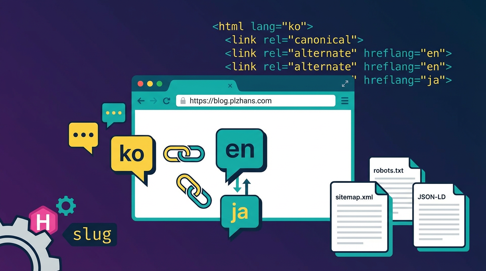

## 目的


Hugoブログに多言語対応とSEO最適化を適用し、検索エンジンへの露出を最大化するとともに、多言語ユーザーに適切な言語バージョンを提供します。


---


## SEO設定


SEO(Search Engine Optimization、検索エンジン最適化)とは、Googleなどの検索エンジンがサイトのコンテンツを正しく理解し、検索結果に表示できるように、サイト構造とメタデータを最適化する作業です。


この文書では、ブログに適用されたSEO設定をまとめます。


### 1. 絶対URL - Hugo baseURL設定

- **ファイル**: `hugo/hugo.toml`
- **内容**: `baseURL = '`[`https://blog.plzhans.com`](https://blog.plzhans.com/)`'`
- sitemap.xml、RSSフィード、Open Graphなどで正しい絶対URLが生成されます
- Sitemap (`sitemap.xml`)、RSSフィード (`index.xml`) はHugoが自動生成します
- `hugo server`(開発時)では自動的に[`localhost:1313`](http://localhost:1313/)を使用するため、別途の処理は不要です

### 2. robots.txtの自動生成

- **ファイル**: `hugo/hugo.toml`
- **内容**: `enableRobotsTXT = true`
- Hugoビルド時に`robots.txt`が自動生成されます(すべてのクローラーを許可 + Sitemap URLを含む)

### 3. [Schema.org](http://schema.org/)構造化データ(JSON-LD)

- **ファイル**: `hugo/layouts/_default/single.html`
- 記事ページ(`type != "page"`)に`BlogPosting`のJSON-LDを挿入します
- 含まれる項目: headline、datePublished、dateModified、author、description、mainEntityOfPage
- Google検索結果でリッチスニペット(作成者、日付など)を表示できます

### 4. og:image(代表画像) / Open Graph

- **ファイル**: `src/services/NotionExportService.mjs`
- Notion同期時にコンテンツ内の最初の画像を検出し、front matterの`images`フィールドに自動追加します
- Open Graphメタタグは、Hugo内蔵テンプレート(`_internal/opengraph.html`)によって出力され、`images`を`og:image`として使用します

### 5. meta description / Twitter Card

- **ファイル**: `src/services/NotionExportService.mjs`
- Notionの「要約」プロパティをfront matterの`description`フィールドとして出力します
- Hugo内蔵のopengraph/twitter_cardsテンプレートおよびbaseof.htmlのmeta descriptionで使用されます
- Twitter Cardのメタタグは、Hugo内蔵テンプレート(`_internal/twitter_cards.html`)によって出力されます
- その他のメタタグ(author、viewport)もテーマがデフォルトで提供します

### 6. Canonical URL

- **ファイル**: `hugo/layouts/_default/baseof.html`
- テーマ(`m10c`)の`baseof.html`をオーバーライドして`<link rel="canonical">`タグを追加します
- `.Permalink`をcanonical URLとして使用します
- 多言語hreflangタグも一緒に含まれます(翻訳ページが存在する場合、`alternate` + `x-default`を出力)

### 7. Google Analytics(GA4)

- テーマ(`m10c`)でデフォルト提供されます
- Google Search Console認証時にGA連携で認証可能です

---


## 多言語SEOの主要要素


### HTML lang属性


ページの言語を明示することで、検索エンジンとスクリーンリーダーに言語情報を提供します。


```html
<html lang="ko">
```


### link rel alternate hreflang


各言語ごとのページURLを検索エンジンに伝えることで、重複コンテンツの問題を防ぎます。


```html
<link rel="alternate" hreflang="ko" href="https://blog.plzhans.com/ko/post/example/">
<link rel="alternate" hreflang="en" href="https://blog.plzhans.com/en/post/example/">
<link rel="alternate" hreflang="ja" href="https://blog.plzhans.com/ja/post/example/">
<link rel="alternate" hreflang="x-default" href="https://blog.plzhans.com/ko/post/example/">
```


### Canonical URL(多言語)


各言語をプロの翻訳として作成した場合、canonicalを省略することで、すべての言語バージョンを独立したオリジナルとして認めてもらうことができます。


```html
<link rel="canonical" href="https://blog.plzhans.com/ko/post/example/">
```


---


## Hugoでの多言語実装


### 1. テーマの多言語対応の確認


**lang属性の確認**(`themes/{テーマ}/layouts/_default/baseof.html`)


```html
<!doctype html>
<html lang=" .Site.Language.Lang ">
```


**relLangURL対応の確認**


ホームリンクが言語別URLを維持しているかを確認します。対応していない場合はbaseof.htmlをオーバーライドします。


```html
<body>
  <header class="app-header">
    <a href=" .Site.Home.RelPermalink "></a>
```


### 2. hugo.tomlの多言語設定


```toml
# デフォルトのコンテンツ言語
defaultContentLanguage = "ko"
# デフォルト言語もサブディレクトリに含める(/ko/)
defaultContentLanguageInSubdir = true

[languages]
  [languages.ko]
    weight = 1
    languageName = "한국어"

  [languages.en]
    weight = 2
    languageName = "English"

  [languages.ja]
    weight = 3
    languageName = "日本語"
```


### 3. canonicalタグの追加


テーマが対応していない場合はbaseof.htmlをオーバーライドします。


```html
<link rel="canonical" href=" .Permalink " />
```


### 4. hreflangタグの生成


**コンテンツファイルにtranslationKeyを設定**


```markdown
---
id: "80"
translationKey: "80"
slug: "80-redis-dump-vs-aof"
title: "Redis dump vs aof"
---
```


**baseof.htmlにhreflangを追加**(テーマが対応していない場合はオーバーライド)


```html
<link rel="alternate" hreflang=" .Language.Lang " href=" .Permalink " />
<link rel="alternate" hreflang="x-default" href=" .Permalink " />
```


---


## トラブルシューティング


### URLの重複衝突


Hugoで投稿のアドレスを設定する際は、`url`ではなく`slug`を使用する必要があります。


**原因**

- `slug`で設定すると、`/ko/`、`/en/`などの言語プレフィックスが自動的に追加されます
- `url`で強制指定すると、Hugoは言語コードを自動的に追加しません
- `url`を使用する場合、`/ko/post/example`、`/en/post/example`のように、各言語ごとにURL自体に言語コードを直接入れる必要があります
- `url`に言語コードなしで同じパスを指定すると、異なる言語の投稿が同じURLを持つことになり、衝突が発生します

**解決方法**

- `url`の代わりに`slug`を使用するように切り替えます
- `hugo.toml`で`defaultContentLanguageInSubdir = true`を設定し、デフォルト言語を含むすべての言語がサブディレクトリ構造を持つようにします

**参考**

- `slug`だけを指定すると言語コードは自動的に追加されますが、slug自体が特定の言語で書かれている場合は、言語ごとに翻訳する必要があります。slugは英語で作成することを推奨します。

### translationKeyを追加したのにhreflangが生成されない


**原因**

- テーマがhreflangタグの生成に対応していません。

**解決方法**

- baseof.htmlにhreflang関連のコードをオーバーライドして追加します

---


## 参照

- [Multi-language Website SEO with Hugo](https://www.glukhov.org/de/post/2025/10/multi-language-website-seo-with-hugo/)

## 関連記事

- [Hugo + Githubでブログを作る](../94-hugo-github-blog/)
- [Github Pagesでカスタムドメインを使う](../86-github-pages-custom-domain/)
