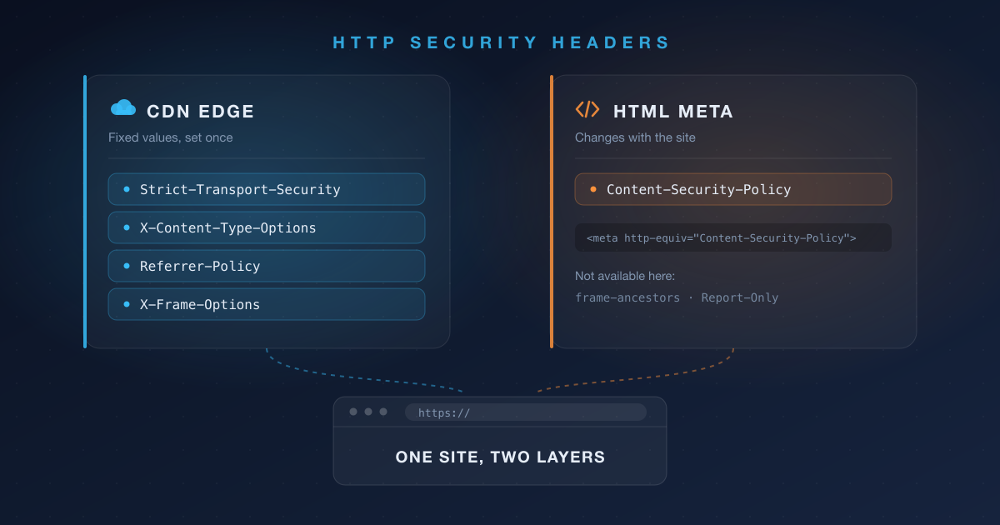

## Overview


SEO audit reports sometimes flag four security headers: `Strict-Transport-Security`, `Content-Security-Policy`, `X-Content-Type-Options`, and `Referrer-Policy`.


At first glance it's odd to see these under "SEO." Short answer up front: **these headers don't directly boost your search ranking.**


This post covers why security headers show up in SEO audits, what each header actually does, and how to apply them on a static blog sitting behind Cloudflare in a combination that's <strong>easy to maintain later</strong>.


## Why SEO reports flag security headers


### They're part of the Lighthouse score


Most SEO audit tools derive their technical SEO score from Google Lighthouse. One of Lighthouse's four categories is <strong>Best Practices</strong>, which includes checks for CSP, HSTS, and `X-Content-Type-Options`.

Strictly speaking, this is a security hygiene check that got folded into the SEO audit framework and reported alongside it. Search engines don't read these headers to rank you.


### The real connection is what happens after you get hacked


The actual causal chain looks like this.

1. An XSS or content-injection attack plants a spam link or malicious script.
2. Google Safe Browsing flags your search results with a warning or removes the page from the index.
3. Your traffic disappears overnight.

Security headers are a preventive measure that lowers the odds of step 1 happening. Audit reports rank this item as high priority <strong>not because it's likely to happen, but because the blast radius is large when it does</strong>.


> 💡 In short, it's not "security headers → higher ranking" but rather the indirect, asymmetric relationship "missing security headers → hack risk → (if it happens) ranking collapse."
> On a static blog with no user uploads and no login form, the attack surface is already small — so on a priority scale, this is less "critical" and more "a safe vaccination to have."


## What each header does


### Strict-Transport-Security (HSTS)


Tells the browser to always connect to this domain over HTTPS from now on. Even if a request goes out as `http://`, the browser rewrites it to `https://` immediately, without asking the server.


Even if you're already doing a 301 redirect to HTTPS, <strong>that very first request happens in plaintext</strong>. On something like public Wi-Fi, this is exactly the window where an attacker can intercept the connection and serve a fake page via SSL stripping. HSTS closes that window.


### Content-Security-Policy (CSP)


A whitelist that defines which origins scripts, images, and styles can be loaded from. Its core job is XSS defense.


Even if one of your external dependencies (a comment widget, analytics, etc.) suffers a supply-chain compromise, or a bug in your content pipeline lets unescaped text slip straight into the HTML, the browser will still refuse to execute scripts from origins that aren't allowlisted.


Think of it as <strong>a second line of defense that still works even if the first line is breached</strong>.


### X-Content-Type-Options: nosniff


Blocks MIME sniffing, where the browser ignores the server-declared `Content-Type` and guesses the file type by inspecting its contents instead.


If that guess is exploited, it opens a bypass where a file that shouldn't be executable ends up running as a script. On a blog with no user uploads the risk is low, but there's no downside either, so it's just left on.


### Referrer-Policy


Controls how much of the originating page's URL gets passed along when a visitor navigates to another site or loads an external resource.


Modern browsers already default to `strict-origin-when-cross-origin` even if you specify nothing. The older default, `no-referrer-when-downgrade`, used to pass the full URL including the path as long as the protocol stayed the same — that changed with a 2020 spec revision.


So this item is less about "information is currently leaking" and more about <strong>explicitly declaring the policy you want instead of relying on the browser default</strong>. It leans more toward visitor privacy than SEO.


## Where to put what


You could cram all the headers into Cloudflare, or put them all in HTML. In practice, the deciding factor is <strong>how often the value changes</strong>.


| Header                     | Where it lives | Reason                                              |
| -------------------------- | --------------- | ---------------------------------------------------- |
| Strict-Transport-Security | Cloudflare      | Once you turn it on, it never needs to change         |
| X-Content-Type-Options    | Cloudflare      | The value is fixed at `nosniff`                       |
| Referrer-Policy           | Cloudflare      | Works as meta too, but a header is more reliable      |
| X-Frame-Options           | Cloudflare      | Fixed value, and meta can't replace it at all         |
| Content-Security-Policy   | HTML meta       | The value changes every time you add an external service |


CSP is the odd one out. Every time you swap analytics tools or add a comment widget, you have to update the allowed origins — and if that lives in Cloudflare, **you have to go into the dashboard every time you touch the site.** It's far more convenient to manage it alongside your site's own repository.


## Headers to put on Cloudflare


### 1. HSTS and nosniff are handled in one screen


SSL/TLS → Edge Certificates → **HTTP Strict Transport Security (HSTS)** → Enable HSTS


| Setting                          | Description                                    |
| --------------------------------- | ------------------------------------------------ |
| Max Age Header                  | 1 to 12 months. Set to 0 to disable              |
| Apply HSTS policy to subdomains | Applies the policy to subdomains as well          |
| Preload                         | For registering with browser preload lists        |
| No-Sniff Header                 | Adds `X-Content-Type-Options: nosniff`            |


Thanks to that last setting, `nosniff` gets handled on this same screen.


> ⚠️ **HSTS is hard to undo**
> Once you enable HSTS, don't do any of the following.
>
> - Switch a DNS record from Proxied to DNS only
> - Pause Cloudflare
> - Redirect HTTPS to HTTP
> - Disable SSL (e.g. due to certificate expiry)
>
> Cloudflare's documentation warns that disabling HSTS, or removing HTTPS before the configured Max Age has elapsed, can leave visitors unable to reach your site for that entire period. It's safer to start with a short Max Age, confirm nothing breaks, and increase it gradually.


### 2. Set the rest via Transform Rules


Rules → Transform Rules → Create rule → **HTTP Response Header Modification**

- Rule name: e.g. `Security Headers`
- When incoming requests match: Hostname equals `blog.example.com`
- Then: add a **Set static** action

| Header name       | Value                             |
| ------------------ | ----------------------------------- |
| Referrer-Policy   | strict-origin-when-cross-origin    |
| X-Frame-Options   | SAMEORIGIN                         |


It's better to scope the condition by hostname rather than matching every request. If another subdomain shares the same zone, it'll get the rule applied unintentionally otherwise.


`X-Frame-Options` prevents other sites from embedding your page in a frame, defending against clickjacking. `SAMEORIGIN` allows only same-origin embedding, `DENY` blocks it everywhere. `ALLOW-FROM` is deprecated, and modern browsers ignore the entire header if that value is present.


> 💡 **Why isn't CSP here?**
> You could add CSP as an action in this same rule. But every time you add one more external service, you'd have to go into Cloudflare and edit the policy string — which gets tedious. So CSP is managed separately via an HTML `meta` tag instead.
>
>
> The trade-off is that `meta` can't set `frame-ancestors`, so the clickjacking-defense job falls to `X-Frame-Options` here.


> 📌 **Note: the Managed Transforms preset isn't recommended**
> Rules → Managed Transforms has a preset toggle called <strong>Add security headers</strong>. It looks convenient, but here's what it sets:
>
> - `x-content-type-options: nosniff`
> - `x-frame-options: SAMEORIGIN`
> - `referrer-policy: same-origin`
> - `x-xss-protection: 1; mode=block`
> - `expect-ct: max-age=86400, enforce`
>
> `referrer-policy` gets set to `same-origin`, which conflicts with the `strict-origin-when-cross-origin` we set earlier, and `x-xss-protection`/`expect-ct` are legacy headers that are effectively meaningless in current browsers.
>
>
> The fact that legacy headers are still in there tells you the preset doesn't immediately reflect current best practice, and you have no control over when its values change. Since it only takes two or three actions in one rule anyway, setting them explicitly yourself is the better call.


## Manage CSP via an HTML meta tag


CSP can also be set via a `meta` tag. Put it inside your site template's `head`, and when you add an external service you can just **edit it alongside your code in the repository.** No more trips to Cloudflare.


```html
<meta http-equiv="Content-Security-Policy" content="default-src 'self'">
```


For Hugo, override the theme's `baseof.html` and add it inside `head`.


### Example policy value


For a blog using Google Analytics and giscus comments, it looks something like this.


```plain text
default-src 'self'; script-src 'self' 'unsafe-inline' https://www.googletagmanager.com https://giscus.app; style-src 'self'; img-src 'self' data:; font-src 'self'; connect-src 'self' https://www.google-analytics.com https://analytics.google.com https://giscus.app; frame-src https://giscus.app; base-uri 'self'; form-action 'self'; object-src 'none'
```


> ⚠️ Note that `'unsafe-inline'` appears in `script-src` above. If you use a tool that injects inline scripts, like a tag manager, it's hard to remove.
> But the moment `'unsafe-inline'` is present, CSP's XSS-defense effectiveness drops significantly. Using this trade-off knowingly is different from using it without realizing it.


### What works via meta and what doesn't


Meta support varies by header. Here's how the headers covered in this post break down.


| Header                                | meta support | Notes                                     |
| -------------------------------------- | ------------- | ------------------------------------------- |
| Content-Security-Policy               | Yes           | Some directives are ignored                |
| Referrer-Policy                       | Yes           | Written as `name="referrer"`               |
| Content-Security-Policy-Report-Only   | No            | Not supported via meta per spec            |
| X-Frame-Options                       | No            | Has no effect if put in meta                |
| X-Content-Type-Options                | No            | Response-header only                       |
| Strict-Transport-Security             | No            | Response-header only; valid only over HTTPS |


CSP can be set via meta, but the following directives get ignored there.

- `frame-ancestors`
- `report-uri`
- `report-to`
- `sandbox`

This is exactly why the example policy above leaves out `frame-ancestors` and instead relies on `X-Frame-Options` for clickjacking defense.


`Content-Security-Policy-Report-Only` also isn't supported in a meta element.


Since you can't use Report-Only, the policy is enforced from the very first deploy. Keep the policy narrow at first, deploy it, and **open your browser devtools console to check for blocked requests as you widen it.** If you'd rather go through an observation phase first, you can temporarily apply `Content-Security-Policy-Report-Only` as a Cloudflare header just for that period, then move the finalized value to meta.


### Setting Referrer-Policy via meta


If you're not using Cloudflare, or can't use Transform Rules, `Referrer-Policy` can also be set via meta.


```html
<meta name="referrer" content="strict-origin-when-cross-origin">
```


The header name has a hyphen — `Referrer-Policy` — but in meta it's not `http-equiv`; it uses the hyphen-free `name="referrer"` instead. Easy to trip over since the names differ.


### Prefer the header when you can


Even for items that support meta, using the actual header is better where possible, because meta has <strong>a gap where no policy applies</strong>.

- **It doesn't apply to content that precedes the meta tag.** The CSP spec strongly recommends placing the meta element as early in the document as possible, and explicitly states that content preceding it is not covered by the policy. In particular, resources preloaded via the `Link` response header, and any `link`/`script` elements above the meta tag, are not blocked. A header has no such gap, since it's already finalized before parsing even begins.
- **It can't be changed after parsing.** Per spec, modifying the `content` attribute after the meta element has been parsed has no effect. For `Referrer-Policy`, dynamically inserting a meta tag makes behavior unpredictable, and if policies conflict, `no-referrer` is applied — you could end up with a different value than you intended.
- **It only exists inside HTML documents.** RSS/Atom feeds, `sitemap.xml`, files left as-is under `static`, and error pages served directly by a CDN have no meta tag at all. Headers apply to those responses too.

In short: **use the actual header wherever you can, and only fall back to meta for cases like CSP where the benefit of managing it alongside your code in the repository outweighs the downside.**


Avoid setting the same policy in both the header and meta at once. If the values drift apart, it's hard to tell which one actually took effect, and `Referrer-Policy` can fall back to `no-referrer` on conflict.


## Verifying it worked


Check headers set on Cloudflare directly against the live response.


```bash
curl -sI https://blog.plzhans.com | grep -i -E "strict-transport|x-content-type|referrer-policy|x-frame-options"
```


CSP isn't a response header — it lives inside the HTML — so check the page source or the Elements tab in devtools. If anything gets blocked, violations will show up in the console.


## Wrap-up

- These headers don't boost your ranking — they're insurance against the worst-case scenario.
- Fixed-value headers belong on Cloudflare; the frequently-changing CSP belongs in your site's repository for easier management.
- The Managed Transforms preset mixes in legacy headers, so set them explicitly via Transform Rules instead.
- HSTS, `X-Content-Type-Options`, and `X-Frame-Options` can't be set via meta — they only work as actual headers.
- Meta CSP can't use `frame-ancestors` or Report-Only. Cover clickjacking defense with `X-Frame-Options` instead.
- Meta doesn't apply to content preceding it or to non-HTML responses. Prefer a header when you have the choice.

## References

- [HTTP Strict Transport Security (HSTS) - Cloudflare SSL/TLS docs](https://developers.cloudflare.com/ssl/edge-certificates/additional-options/http-strict-transport-security/)
- [Managed Transforms reference - Cloudflare Rules docs](https://developers.cloudflare.com/rules/transform/managed-transforms/reference/)
- [Content-Security-Policy: frame-ancestors - MDN](https://developer.mozilla.org/en-US/docs/Web/HTTP/Reference/Headers/Content-Security-Policy/frame-ancestors)
- [Content-Security-Policy-Report-Only - MDN](https://developer.mozilla.org/en-US/docs/Web/HTTP/Reference/Headers/Content-Security-Policy-Report-Only)
- [X-Frame-Options - MDN](https://developer.mozilla.org/en-US/docs/Web/HTTP/Reference/Headers/X-Frame-Options)
- [X-Content-Type-Options - MDN](https://developer.mozilla.org/en-US/docs/Web/HTTP/Reference/Headers/X-Content-Type-Options)
- [meta name="referrer" - MDN](https://developer.mozilla.org/en-US/docs/Web/HTML/Reference/Elements/meta/name/referrer)
- [Content Security Policy Level 3 - W3C](https://w3c.github.io/webappsec-csp/)
