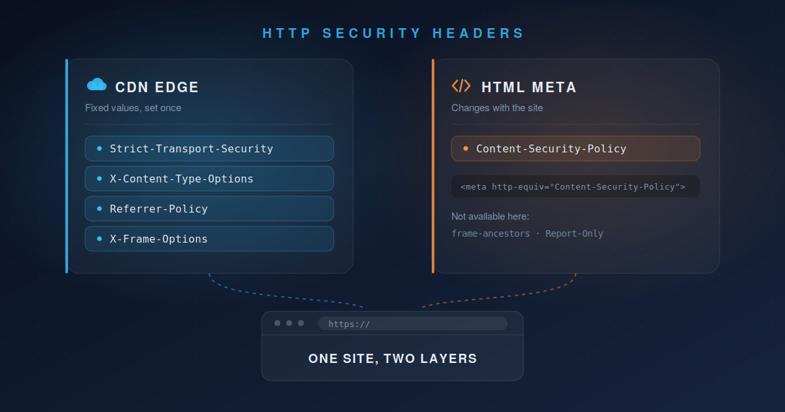

## 概要


SEO監査レポートで、4つのセキュリティヘッダーが指摘されることがあります。`Strict-Transport-Security`、`Content-Security-Policy`、`X-Content-Type-Options`、`Referrer-Policy`です。


最初はなぜこれがSEO項目なのかと思うはずです。結論から言うと、**これらのヘッダーは検索順位を直接上げてくれるわけではありません。**


この記事では、なぜSEO監査にセキュリティヘッダーが含まれるのか、各ヘッダーが何をするのか、そしてCloudflareを前段に置いた静的ブログで<strong>後から管理しやすい組み合わせ</strong>で適用する方法を整理します。


## なぜSEOレポートがセキュリティヘッダーを指摘するのか


### Lighthouseスコアに含まれている


ほとんどのSEO監査ツールはGoogle Lighthouseをベースに技術SEOスコアを算出します。Lighthouseの4つのカテゴリのうち1つが<strong>Best Practices</strong>で、ここにCSP、HSTS、`X-Content-Type-Options`のチェックが含まれています。


厳密にはセキュリティ衛生の点検なのですが、SEO監査フレームワークに組み込まれて一緒に報告されているのです。検索エンジンがこのヘッダーを読んで順位付けしているわけではありません。


### 本当のつながりはハッキングされた時の結果


実質的なつながりは次の経路です。

1. XSSやコンテンツインジェクションでスパムリンクや悪意のあるスクリプトが挿入される。
2. Google Safe Browsingが検索結果に警告を付けるか、インデックスから除外する。
3. トラフィックが一夜にして消える。

セキュリティヘッダーは1番が起こる確率を下げる予防措置です。監査レポートがこの項目を高優先度に分類するのは、<strong>発生確率が高いからではなく、起きた時のインパクトが大きいから</strong>です。


> 💡 まとめると「セキュリティヘッダー → 順位上昇」ではなく、「セキュリティヘッダー不在 → ハッキングリスク → (発生した場合)順位崩壊」という間接的で非対称な関係です。
> ユーザーアップロードもログインフォームもない静的ブログなら攻撃対象領域そのものが小さいため、優先度としては致命的というよりは、やっておくと安全な予防接種に近いものです。


## 各ヘッダーの役割


### Strict-Transport-Security (HSTS)


ブラウザに対して、このドメインには今後必ずHTTPSでのみ接続するよう指示します。`http://`でリクエストが発生してもサーバーに確認せず、ブラウザが即座に`https://`に変換します。


すでに301でHTTPSリダイレクトをしていても、<strong>その最初のリクエストの瞬間は平文</strong>です。公共Wi-Fiのような環境で攻撃者が中間で傍受し、偽のページを表示するSSLストリッピングが可能な区間がまさにここです。HSTSはその区間をなくします。


### Content-Security-Policy (CSP)


スクリプト、画像、スタイルをどの取得元から読み込めるかを定めるホワイトリストです。中核となる役割はXSS防御です。


外部依存(コメントウィジェット、アナリティクスなど)のいずれかがサプライチェーン攻撃を受けたり、コンテンツパイプラインのバグでエスケープされていないテキストがそのままHTMLに入り込む事故が起きても、許可されていない取得元からのスクリプト実行をブラウザが拒否します。


<strong>一次防御線が突破されても機能する二次防御線</strong>だと考えてください。


### X-Content-Type-Options: nosniff


ブラウザがサーバーの示した`Content-Type`を無視して、ファイルの内容を見て種類を自ら推測するMIMEスニッフィングを防ぎます。


この推測が悪用されると、実行されてはいけないファイルがスクリプトとして実行される迂回経路が生まれます。ユーザーアップロードのないブログならリスクは低いですが、副作用がないためそのまま有効にしておく項目です。


### Referrer-Policy


訪問者が他のサイトへ移動したり外部リソースを読み込んだりする際、どのページから来たのかをどこまで渡すかを定めます。


最近のブラウザは何も指定しなくてもデフォルト値がすでに`strict-origin-when-cross-origin`になっています。以前のデフォルトだった`no-referrer-when-downgrade`は、プロトコルさえ同じであればパスまで含めた完全なURLを渡していましたが、2020年の仕様改定で基準が変わりました。


そのため、この項目は「今まさに情報が漏れている」というよりは、<strong>ブラウザのデフォルト値に依存せず、サイトが望むポリシーを明示しておく</strong>という意味合いが大きいです。SEOよりも訪問者のプライバシーの性格が強い項目です。


## どこに何を置くか


ヘッダーを全部Cloudflareに集約することもできますし、全部HTMLに入れることもできます。実際に運用してみると、<strong>値が変わる頻度</strong>が基準になります。


| ヘッダー                     | 置き場所      | 理由                          |
| -------------------------- | ---------- | ------------------------------ |
| Strict-Transport-Security | Cloudflare | 一度有効にすれば変わることがない        |
| X-Content-Type-Options    | Cloudflare | 値が`nosniff`固定である             |
| Referrer-Policy           | Cloudflare | metaでもできるがヘッダーの方が確実         |
| X-Frame-Options           | Cloudflare | 値が固定で、metaでは代替できない          |
| Content-Security-Policy   | HTML meta  | 外部サービスを追加するたびに値が変わる       |


CSPだけ性格が異なります。アナリティクスを乗り換えたりコメントウィジェットを追加するたびに許可元を修正する必要があり、これをCloudflareに置くと**サイトをいじるたびにダッシュボードに入らなければなりません。**サイトのリポジトリで一緒に管理する方がはるかに楽です。


## Cloudflareに置くヘッダー


### 1. HSTSとnosniffは1画面で完結する


SSL/TLS → Edge Certificates → **HTTP Strict Transport Security (HSTS)** → Enable HSTS


| 設定                              | 説明                                    |
| ------------------------------- | ---------------------------------------- |
| Max Age Header                  | 1〜12ヶ月。0にすると無効化                  |
| Apply HSTS policy to subdomains | サブドメインまでポリシーを適用               |
| Preload                         | ブラウザのプリロードリスト登録用             |
| No-Sniff Header                 | `X-Content-Type-Options: nosniff`を追加   |


最後の項目のおかげで`nosniff`はこの画面で一緒に解決されます。


> ⚠️ **HSTSは元に戻しにくい**
> HSTSを有効にした後は、以下の作業をしてはいけません。
>
> - DNSレコードをProxiedからDNS onlyに変更
> - Cloudflareを一時停止
> - HTTPSをHTTPにリダイレクト
> - 証明書の失効などでSSLを無効化
>
> Cloudflareのドキュメントは、設定したMax Ageが過ぎる前にHSTSを無効化したりHTTPSを外したりすると、その期間中訪問者がサイトにアクセスできなくなると警告しています。最初はMax Ageを短く設定し、問題がないことを確認してから伸ばしていく方が安全です。


### 2. 残りはTransform Rulesで指定する


Rules → Transform Rules → Create rule → **HTTP Response Header Modification**

- Rule name: 例)`Security Headers`
- When incoming requests match: Hostname equals `blog.example.com`
- Then: **Set static**アクションを追加

| ヘッダー名           | 値                               |
| --------------- | ---------------------------------- |
| Referrer-Policy | strict-origin-when-cross-origin    |
| X-Frame-Options | SAMEORIGIN                         |


条件をすべてのリクエストにせず、<strong>hostnameで範囲を絞る方</strong>が良いです。同じzoneに別のサブドメインがあると、意図せず一緒に適用されてしまいます。


`X-Frame-Options`は他のサイトが自分のページをフレームに入れることを防ぎ、クリックジャッキングを防御します。`SAMEORIGIN`は同じオリジンからのみ許可、`DENY`はどこからも不可です。`ALLOW-FROM`は廃止された値のため、最新のブラウザはこの値があるとヘッダー全体を無視します。


> 💡 **なぜここにCSPがないのか**
> CSPもこのルールにアクションとして追加できます。ただし外部サービスを1つ追加するたびにCloudflareに入ってポリシー文字列を修正しなければならず面倒です。そのためCSPは後述のHTML `meta`タグで管理します。
>
>
> 代わりに`meta`では`frame-ancestors`が使えないため、クリックジャッキング防御の役割はここで`X-Frame-Options`が担います。


> 📌 **参考: Managed Transformsプリセットは推奨しない**
> Rules → Managed Transformsには<strong>Add security headers</strong>というプリセットトグルがあります。便利に見えますが、このプリセットが付与する値は次の通りです。
>
> - `x-content-type-options: nosniff`
> - `x-frame-options: SAMEORIGIN`
> - `referrer-policy: same-origin`
> - `x-xss-protection: 1; mode=block`
> - `expect-ct: max-age=86400, enforce`
>
> `referrer-policy`が`same-origin`で付与され、前に指定した`strict-origin-when-cross-origin`と値が重複し、`x-xss-protection`と`expect-ct`は現在のブラウザでは事実上意味のないレガシーヘッダーです。
>
>
> レガシーヘッダーがそのまま残っていることからも分かるように、プリセットは最新の推奨事項を即座に反映せず、値がいつ変わるかもこちらでコントロールできません。どのみちルール1つにアクション2〜3個で済むため、直接指定する方をお勧めします。


## CSPはHTML metaタグで管理する


CSPは`meta`タグでも指定できます。サイトテンプレートの`head`内に入れておけば、外部サービスを追加する際に**リポジトリでコードと一緒に修正すればよく**なります。Cloudflareに入る必要がなくなります。


```html
<meta http-equiv="Content-Security-Policy" content="default-src 'self'">
```


Hugoならテーマの`baseof.html`をオーバーライドして`head`内に入れます。


### ポリシー値の例


Google Analyticsとgiscusコメントを使うブログなら、このような形になります。


```plain text
default-src 'self'; script-src 'self' 'unsafe-inline' https://www.googletagmanager.com https://giscus.app; style-src 'self'; img-src 'self' data:; font-src 'self'; connect-src 'self' https://www.google-analytics.com https://analytics.google.com https://giscus.app; frame-src https://giscus.app; base-uri 'self'; form-action 'self'; object-src 'none'
```


> ⚠️ 上記の例の`script-src`には`'unsafe-inline'`が入っています。タグマネージャーのようにインラインスクリプトを挿入するツールを使うと外しにくいです。
> ただし`'unsafe-inline'`が入った瞬間、CSPのXSS防御効果は大きく下がります。このトレードオフを知って使うのと知らずに使うのとでは違います。


### metaでできることとできないこと


ヘッダーごとにmetaサポートの有無が異なります。この記事で扱ったヘッダーを整理すると次のようになります。


| ヘッダー                                  | meta指定 | 備考                          |
| ----------------------------------- | ------- | -------------------------------- |
| Content-Security-Policy             | 可能      | 一部のディレクティブは無視される     |
| Referrer-Policy                     | 可能      | `name="referrer"`の形で書く       |
| Content-Security-Policy-Report-Only | 不可      | 仕様上metaは非サポート             |
| X-Frame-Options                     | 不可      | metaに入れても効果がない            |
| X-Content-Type-Options              | 不可      | レスポンスヘッダー専用               |
| Strict-Transport-Security           | 不可      | レスポンスヘッダー専用。HTTPSレスポンスでのみ有効 |


CSPはmetaで指定できますが、次のディレクティブはmetaでは無視されます。

- `frame-ancestors`
- `report-uri`
- `report-to`
- `sandbox`

先のポリシー値の例で`frame-ancestors`を入れず、クリックジャッキング防御を`X-Frame-Options`に任せた理由がこれです。


`Content-Security-Policy-Report-Only`もmeta要素ではサポートされていません。


Report-Onlyが使えないため、最初から強制的に適用されます。ポリシーを狭く設定してデプロイした後、**ブラウザの開発者ツールのコンソールを開いてブロックされるリクエストがないか確認しながら広げていきます。**あえて観察段階を経たい場合は、その間だけCloudflareヘッダーで`Content-Security-Policy-Report-Only`を一時的に適用し、値が確定したらmetaに移す方法もあります。


### Referrer-Policyをmetaで使う場合


Cloudflareを使わない、またはTransform Rulesが使えない環境なら、`Referrer-Policy`はmetaでも入れられます。


```html
<meta name="referrer" content="strict-origin-when-cross-origin">
```


ヘッダー名はハイフンのある`Referrer-Policy`ですが、metaでは`http-equiv`ではなくハイフンのない`name="referrer"`を使います。名前が異なるため混同しやすい部分です。


### できればヘッダーを使う


metaで指定できる項目でも、ヘッダーが使えるならヘッダーに置く方が良いです。metaには<strong>ポリシーが空白になる区間</strong>があるためです。

- **metaより前のコンテンツには適用されない。** CSP仕様はmeta要素をできるだけ文書の前方に置くよう強く推奨しており、metaより前のコンテンツにはポリシーが適用されないと明記しています。特に`Link`レスポンスヘッダーでプリロードされたリソースや、metaより上にある`link`・`script`要素はブロックされません。ヘッダーはパース開始前にすでに確定しているため、この区間がありません。
- **パースされた後は変更できない。** 仕様上、metaがパースされた後に`content`属性を修正しても無視されます。`Referrer-Policy`はmetaを動的に挿入すると動作が予測不可能になり、ポリシーが衝突すると`no-referrer`が適用されます。意図した値と異なる値になる可能性があります。
- **HTML文書内にのみ存在する。** RSS/Atomフィード、`sitemap.xml`、`static`にそのまま置いたファイル、CDNが独自に返すエラーページにはmetaがありません。ヘッダーはそれらのレスポンスにも付与されます。

まとめると、**ヘッダーで指定できるならヘッダーに置き、CSPのように値が頻繁に変わりリポジトリでコードと一緒に管理する利点が大きい場合のみmetaに落とします。**


同じポリシーをヘッダーとmetaの両方に置くのは避けます。値がずれるとどちらが適用されたのか追跡しにくく、`Referrer-Policy`は衝突時に`no-referrer`になる可能性があります。


## 適用確認


Cloudflareに設定したヘッダーはレスポンスを直接確認します。


```bash
curl -sI https://blog.plzhans.com | grep -i -E "strict-transport|x-content-type|referrer-policy|x-frame-options"
```


CSPはレスポンスヘッダーではなくHTML内に入るため、ページのソースやブラウザの開発者ツールのElementsタブで確認します。ブロックされたリクエストがあればコンソールに違反内容が残ります。


## まとめ

- これらのヘッダーは順位を上げる項目ではなく、最悪の事態を防ぐ保険です。
- 値が固定のヘッダーはCloudflareに、頻繁に変わるCSPはサイトのリポジトリに置くと管理が楽です。
- Managed Transformsプリセットはレガシーヘッダーが混ざっているため、Transform Rulesで直接指定します。
- HSTS、`X-Content-Type-Options`、`X-Frame-Options`はmetaで指定できません。ヘッダーでのみ動作します。
- meta CSPは`frame-ancestors`とReport-Onlyが使えません。クリックジャッキング防御は`X-Frame-Options`で補います。
- metaはそれより前のコンテンツやHTML以外のレスポンスには適用されません。選べるならヘッダーが安全です。

## 参考

- [HTTP Strict Transport Security (HSTS) - Cloudflare SSL/TLS docs](https://developers.cloudflare.com/ssl/edge-certificates/additional-options/http-strict-transport-security/)
- [Managed Transforms reference - Cloudflare Rules docs](https://developers.cloudflare.com/rules/transform/managed-transforms/reference/)
- [Content-Security-Policy: frame-ancestors - MDN](https://developer.mozilla.org/en-US/docs/Web/HTTP/Reference/Headers/Content-Security-Policy/frame-ancestors)
- [Content-Security-Policy-Report-Only - MDN](https://developer.mozilla.org/en-US/docs/Web/HTTP/Reference/Headers/Content-Security-Policy-Report-Only)
- [X-Frame-Options - MDN](https://developer.mozilla.org/en-US/docs/Web/HTTP/Reference/Headers/X-Frame-Options)
- [X-Content-Type-Options - MDN](https://developer.mozilla.org/en-US/docs/Web/HTTP/Reference/Headers/X-Content-Type-Options)
- [meta name="referrer" - MDN](https://developer.mozilla.org/en-US/docs/Web/HTML/Reference/Elements/meta/name/referrer)
- [Content Security Policy Level 3 - W3C](https://w3c.github.io/webappsec-csp/)
