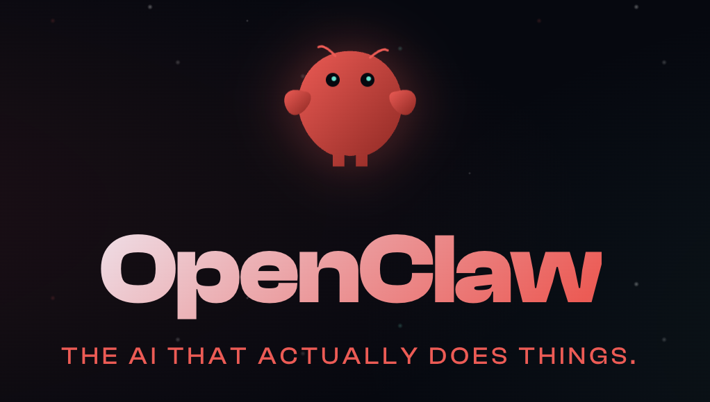
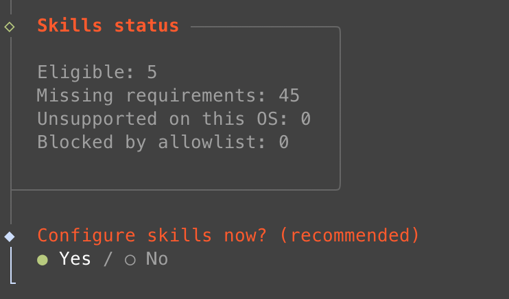
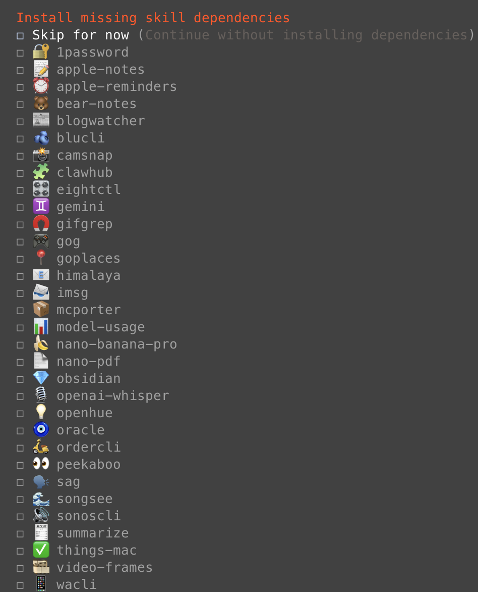
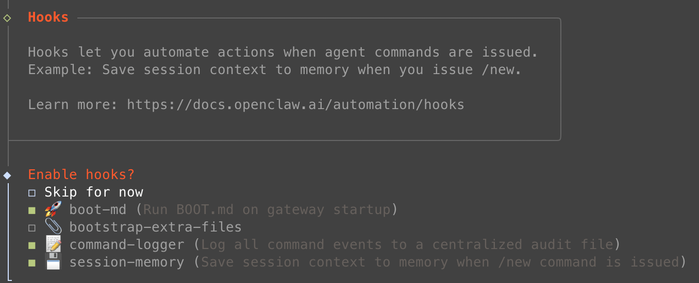
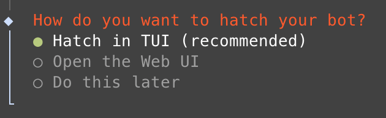
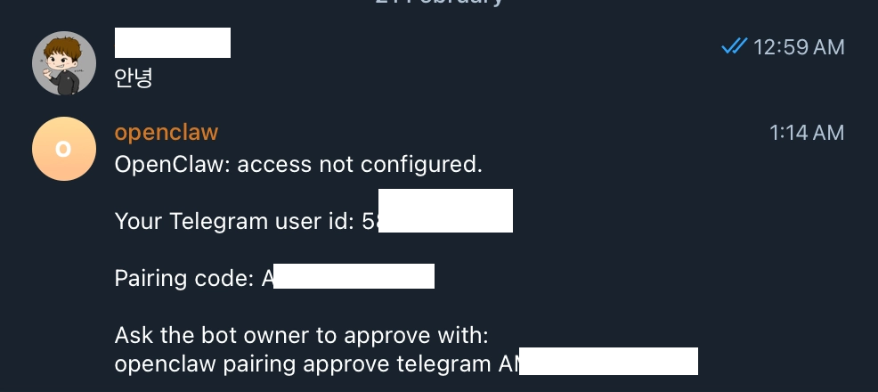
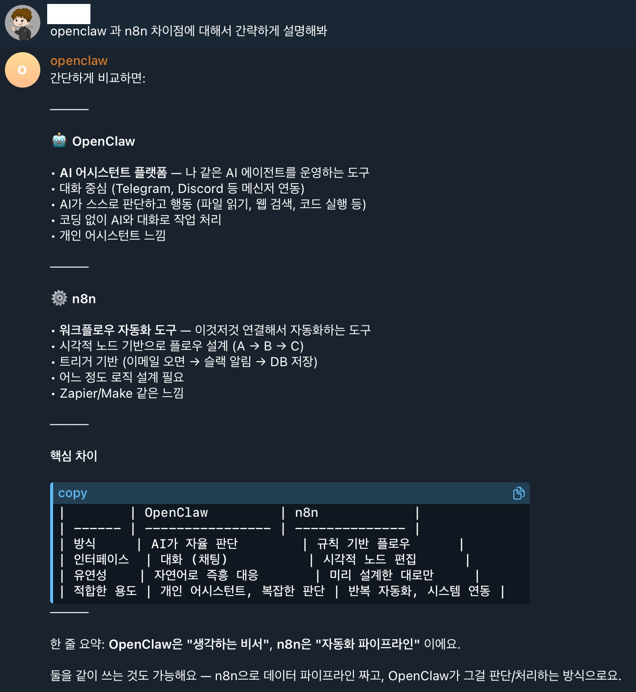

## 개요


### OpenClaw란


OpenClaw는 개발자가 자율적으로 동작하는 AI 에이전트를 구축할 수 있게 해주는 <strong>Node.js 기반 오픈소스 프레임워크</strong>다.


Claude, GPT 같은 다양한 모델과 연동할 수 있다.


파일 읽기, 명령 실행, 외부 서비스 호출 같은 작업을 도구로 연결해서 자동화할 수 있다.


공식 사이트: [OpenClaw](https://openclaw.ai/)


### 주요 특징

- **멀티모달 입력,** 텍스트, 이미지, 파일 등 여러 형태의 입력을 처리한다.
- **도구 통합,** 파일 시스템 접근, 웹 검색, API 호출 같은 기능을 도구로 붙여서 확장한다.
- **보안 중심 설계,** 샌드박스, 접근 제어, 화이트리스트 같은 장치를 제공한다.
- **확장 가능한 구조,** 플러그인 방식으로 기능을 추가하기 쉽다.

## 설치


OpenClaw는 설치 스크립트를 제공한다.


Node.js 같은 필수 유틸리티도 함께 설치한다.


설치 문서: [https://docs.openclaw.ai/install](https://docs.openclaw.ai/install)


### 기본 설치 모드


기본 설치는 설치 직후 **onboard(대화형 초기 설정)** 로 진입한다.


설정이 끝나면 실행 단계로 넘어간다.


```shell
# macOS / Linux / WSL2
curl -fsSL https://openclaw.ai/install.sh | bash

# Windows (PowerShell)
iwr -useb https://openclaw.ai/install.ps1 | iex
```


onboard 없이 설치만 하고 싶으면 아래 옵션을 사용한다.


```shell
# macOS / Linux / WSL2
curl -fsSL https://openclaw.ai/install.sh | bash -s -- --no-onboard

# Windows (PowerShell)
& ([scriptblock]::Create((iwr -useb https://openclaw.ai/install.ps1))) -NoOnboard
```


설치 이후에는 아래 순서로 진행한다.


```shell
# 설정하기
openclaw onboard

# 실행하기
openclaw gateway start
```



### 기본 설치 화면


## 초기 설정(onboard)


기본 설치 모드를 진행하면 설치 후 onboard로 진입한다.


설정은 대화형 UI로 진행한다.


설정 파일은 기본적으로 `~/.openclaw/openclaw.json` 에 기록된다.


onboard를 중간에 끊어도 다시 실행하면 이어서 편집할 수 있다.


필요하면 초기화 후 다시 설정할 수도 있다.


### 1. 보안 경고 동의


> ⚠️ ⚠️ **보안 경고 — 반드시 읽어 주세요**


### 2. 설치 모드 선택


> 💡 Manual 모드는 게이트웨이와 워크스페이스를 수동으로 지정할 때 사용한다.  
> Manual 모드에서 지정할 수 있는 것


### 3. 모델 및 인증 공급자 선택


> 💡 필요한 공급자를 활성화하면 된다.  
> 선택하면 인증 절차를 안내해 준다.  
>   
> Claude(Anthropic) 예시


> 💡 ChatGPT 같은 클라우드 모델은 API 키 방식이면 사용량 기반 과금이 될 수 있다.  
> 하지만 구독형 계정을 쓰는 경우에도 API 키 없이 연동되는 방식이 있으니 살펴볼 만하다.  
>   
> - ChatGPT: OpenAI Codex (ChatGPT OAuth)  
>   
> - Claude: Anthropic token (setup-token 붙여넣기)  
>   
> - Gemini: Google Gemini CLI OAuth


### 4. 채널 선택


> 💡 원하는 메신저 채널을 선택한다.  
> 텔레그램은 무료라서 선택하는 경우가 많다.  
>   
> 텔레그램 봇 토큰 생성 및 입력


### 5. 스킬 선택








> 💡 OpenClaw는 부가 기능을 스킬, 플러그인 같은 형태로 제공한다.  
> 기본적으로 필요한 스킬만 켜고 시작해도 된다.  
>   
> 반복적으로 시키는 업무는 나중에 스킬로 만들어 붙일 수 있다.  
>   
> 고급 기능에 필요한 설정 예시


### 6. Hook 설정





> 💡 - **boot-md**  
>   
> - **bootstrap-extra-files**  
>   
> - **command-logger**  
>   
> - **session-memory**


### 7. 봇 실행





> 💡 macOS에서 실행 허용이 필요한 경우


실행 화면


### 8. 텔레그램 유저 인증





> 💡 봇을 만든 뒤 메시지를 보내면 유저 인증을 진행한다.  
> 아무 사용자나 봇을 통해 OpenClaw에 접근하면 안 되기 때문에 인증이 필요하다.  
>   
> 인증 코드는 텔레그램 메시지로 전달된다.  
>   
> 안내된 명령어를 복사해서 터미널에서 수동으로 실행하면 된다.  
>   
> 


### 9. 내 호칭과 봇 이름 정하기


> 💡 봇이 사용자를 부를 이름과 사용자가 봇을 부를 이름을 정한다.  
> 설정 후에는 일반 ChatGPT처럼 대화하며 쓸 수 있다.


### 10. 예시





