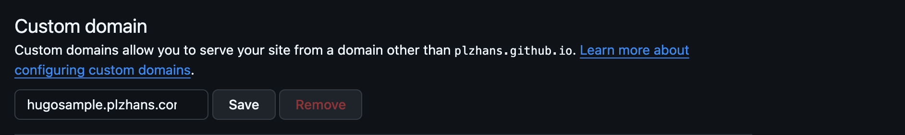

# 概要

GitHub Pagesはデフォルトで `https://{アカウント名}.`[`github.io/{リポジトリ名}/`](http://github.io/%7B저장소명%7D/) 形式のURLを提供します。

このドキュメントではカスタムドメインを接続する方法を説明します。

# サブドメインの使用

`hugosample.plzhans.com` のようなサブドメインを使用する場合です。

## DNS設定

ドメインのDNS設定でCNAMEレコードを追加します。

**設定例**

- Type: CNAME
- Name: サブドメイン（例: hugosample）
- Value: {アカウント名}.[github.io](http://github.io/)

## GitHub Pages設定

Repository → Settings → Pages → Custom domainでカスタムドメインを入力します。

**入力例:** hugosample.plzhans.com

# Apexドメインの使用

`plzhans.com` のようにドメインルートを使用する場合です。

## DNS設定

DNSプロバイダーに応じてA、AAAA、またはALIASレコードを設定します。

| レコードタイプ       | Name | Value                                                                           |
| -------------- | ---- | ------------------------------------------------------------------------------- |
| A              | @    | 185.199.108.153 185.199.109.153 185.199.110.153 185.199.111.153                 |
| AAAA           | @    | 2606:50c0:8000::153 2606:50c0:8001::153 2606:50c0:8002::153 2606:50c0:8003::153 |
| ALIASまたはANAME | @    | USERNAME.github.io                                                              |

**注意:** ALIAS/ANAMEレコードをサポートしていないDNSプロバイダーの場合はAレコードを使用します。

## GitHub Pages設定

Repository → Settings → Pages → Custom domainでカスタムドメインを入力します。

**入力例:** plzhans.com

# HTTPSの有効化

**Enforce HTTPS** オプションにチェックを入れるとHTTPS証明書が自動的に適用されます。

> ⚠️ 証明書の発行と伝播には最大24時間かかる場合があります。HTTPS接続ができない場合は、1日程度待ってから再度お試しください。

---

参考

- [GitHub公式ドキュメント: カスタムドメインの管理](https://docs.github.com/ko/pages/configuring-a-custom-domain-for-your-github-pages-site/managing-a-custom-domain-for-your-github-pages-site)
