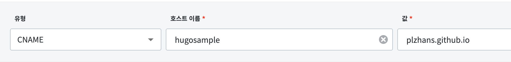

# 개요

GitHub Pages는 기본적으로 `https://{계정명}.`[`github.io/{저장소명}/`](http://github.io/%7B저장소명%7D/) 형식의 URL을 제공한다. 

이 문서는 커스텀 도메인을 연결하는 방법을 설명한다.

# 서브(하위) 도메인 사용

`hugosample.plzhans.com`과 같은 서브 도메인을 사용하는 경우다.

## DNS 설정

도메인 DNS 설정에서 CNAME 레코드를 추가한다.

**​설정 예시**

- Type: CNAME
- Name: 서브도메인 (예: hugosample)
- Value: {계정명}.[github.io](http://github.io/)

## GitHub Pages 설정

Repository → Settings → Pages → Custom domain에서 커스텀 도메인을 입력한다.

**​입력 예시:** hugosample.plzhans.com

# Apex 도메인 사용

`plzhans.com`과 같이 도메인 루트를 사용하는 경우다.

## DNS 설정

DNS 제공업체에 따라 A, AAAA 또는 ALIAS 레코드를 설정한다.

| 레코드 타입         | Name | Value                                                                           |
| -------------- | ---- | ------------------------------------------------------------------------------- |
| A              | @    | 185.199.108.153 185.199.109.153 185.199.110.153 185.199.111.153                 |
| AAAA           | @    | 2606:50c0:8000::153 2606:50c0:8001::153 2606:50c0:8002::153 2606:50c0:8003::153 |
| ALIAS 또는 ANAME | @    | USERNAME.github.io                                                              |

**​참고:** ALIAS/ANAME 레코드를 지원하지 않는 DNS 제공업체는 A 레코드를 사용한다.

## GitHub Pages 설정

Repository → Settings → Pages → Custom domain에서 커스텀 도메인을 입력한다.

**​입력 예시:** plzhans.com

# HTTPS 활성화

**Enforce HTTPS** 옵션을 체크하면 HTTPS 인증서가 자동으로 적용된다.

> ⚠️ 인증서 발급과 전파에는 최대 24시간이 소요될 수 있다. HTTPS 연결이 되지 않는다면 하루 정도 기다린 후 다시 시도한다.

---

참고

- [GitHub 공식 문서: 커스텀 도메인 관리](https://docs.github.com/ko/pages/configuring-a-custom-domain-for-your-github-pages-site/managing-a-custom-domain-for-your-github-pages-site)
