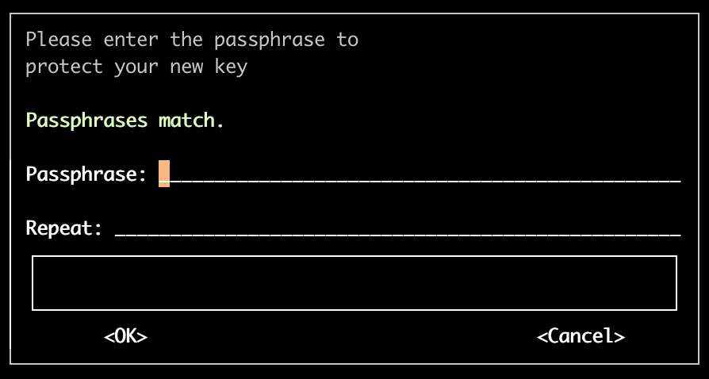
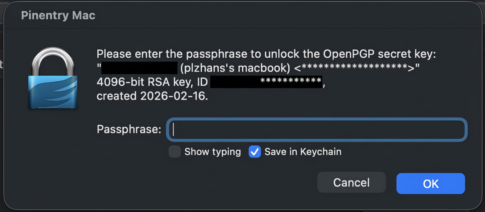
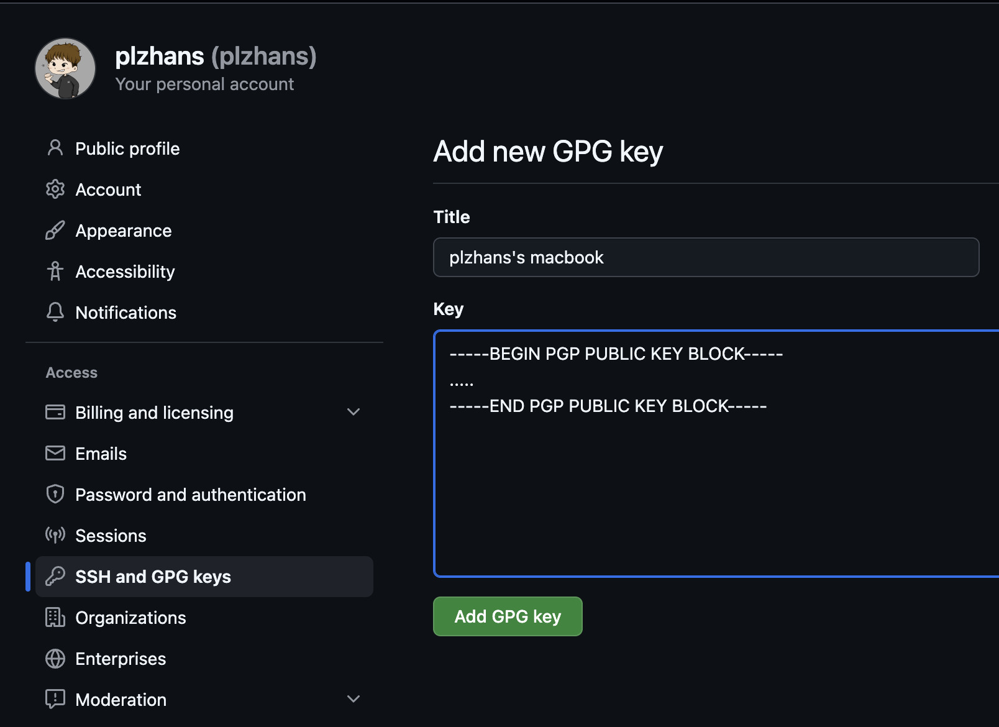
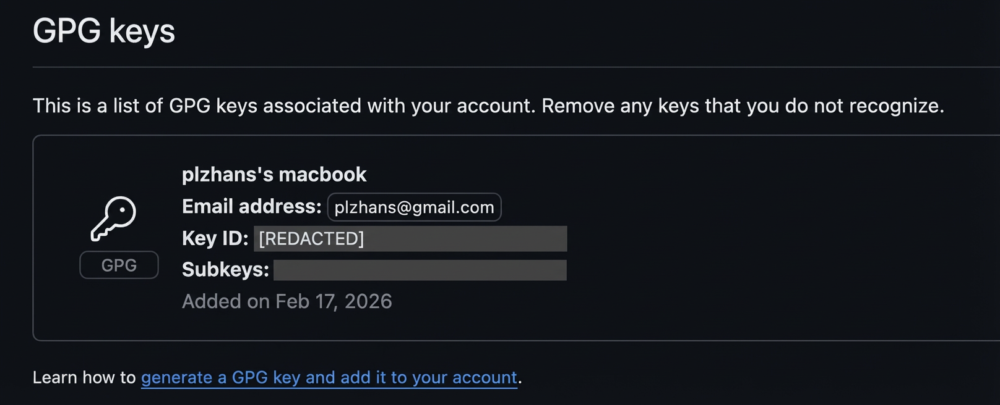

## 개요


Git 커밋에 GPG 디지털 서명을 추가하면 커밋 작성자의 신원을 증명하고 코드 무결성을 보장할 수 있습니다. 


이 문서에서는 GPG의 개념과 Git에서의 활용 방법을 소개합니다.


GPG 키 생성부터 Git 설정, GitHub 연동까지 전체 과정을 단계별로 안내합니다. 


## GPG란?


**GPG(GNU Privacy Guard)**는 데이터 암호화와 디지털 서명을 위한 오픈 소스 암호화 소프트웨어입니다. 


PGP(Pretty Good Privacy) 표준을 따르며 공개키 암호화 방식을 사용합니다.


**주요 특징**

- **공개키 암호화:** 공개키와 개인키 쌍으로 데이터를 암호화하고 복호화합니다.
- **디지털 서명:** 개인키로 데이터에 서명합니다. 작성자 신원과 데이터 무결성을 보장합니다.
- **보안 통신:** 이메일과 파일 등을 안전하게 암호화해 전송할 수 있습니다.

### **Git과 GPG**


Git에서 GPG는 커밋과 태그에 디지털 서명을 추가할 때 사용합니다. 

- 커밋이 실제로 본인에 의해 작성되었음을 증명할 수 있습니다.
- GitHub와 GitLab 같은 플랫폼에서 "Verified" 배지를 표시해 신뢰성을 높입니다.
- 코드 변조와 위조를 방지해 프로젝트 보안을 강화합니다.
- 파일을 암호화하여 보호합니다

### Git 커밋을 왜 서명하나요?


Git 커밋 작성자 정보는 `git config user.name`과 `user.email`로 누구나 임의 설정이 가능합니다.


따라서 이름과 이메일만으로는 실제 작성자를 신뢰하기 어렵습니다.


커밋 전에 개인키로 커밋에 서명하고 공개키를 GitHub 같은 저장소에 등록하면 플랫폼이 서명을 검증해 커밋 작성자 일치 여부를 확인할 수 있습니다.


## GPG 사용하기


### gnupg 설치


gnupg : GPG 를 사용하기 위한 패키지 설치 (예: mac)


```toml
brew install gnupg
```


### 키 생성


`gpg --full-generate-key`는 대화형 모드로 기본 동작합니다.  배치 모드도 옵션으로 지원합니다.


```toml
gpg --full-generate-key
```

> Please select what kind of key you want:  
> (1) RSA and RSA  
> (2) DSA and Elgamal  
> (3) DSA (sign only)  
> (4) RSA (sign only)  
> (9) ECC (sign and encrypt) _default_  
> (10) ECC (sign only)  
> (14) Existing key from card  
> Your selection? 1  
>   
> RSA keys may be between 1024 and 4096 bits long.  
> What keysize do you want? (3072) 4096  
> 
>
> Requested keysize is 4096 bits
> Please specify how long the key should be valid.
> 0 = key does not expire
> \<n\>  = key expires in n days
> \<n\>w = key expires in n weeks
> \<n\>m = key expires in n months
> \<n\>y = key expires in n years
> Key is valid for? (0) 1y
>
>
> Key is valid for? (0) 1y
> Key expires at 2027년  2월 16일 화요일 17시 14분 10초 KST
> Is this correct? (y/N) y
>
>
> GnuPG needs to construct a user ID to identify your key.
>
>
> Real name: your name
> Email address: your test@email.com
> Not a valid email address
> Email address: test@test.com
> Comment: test
> You selected this USER-ID:
> "your name (test) test@test.com"
>
>




### 키 생성 확인


```shell
# 개인키 목록
gpg --list-secret-keys

# 공개키 목록
gpg --list-keys
```


### 기타 필요한 기능

<details>
<summary>키 삭제가 필요한 경우</summary>

```shell
# 개인키 삭제
gpg --delete-secret-keys {sec uuid}

# 공개키 삭제
gpg --delete-keys {pub uuid}
```


</details>

<details>
<summary>키 내보내기</summary>

```shell
# 개인키 내보내기
# gpg --armor --export-secret-keys {key_id} > private.asc
gpg --armor --export-secret-keys 7XXXXXXXXXXXXXXXX6 > private.asc

# 공개키 내보내기
# gpg --armor --export {key_id} > public.asc
gpg --armor --export 7XXXXXXXXXXXXXXXX6 > public.asc
```


</details>

<details>
<summary>키 복원하기</summary>

```toml
# 
gpg --import private.asc

# trust 지정 
# gpg --edit-key {key_id}
gpg --edit-key 7XXXXXXXXXXXXXXXX6

# 등록 확인
gpg --list-secret-keys --keyid-format LONG
```


</details>


### (참고) 트러블슈팅


### 문제 : Passphrase(키 암호)를 사용하지 않으려고 했습니다. 키 생성 과정이 다시 암호 입력 화면으로 돌아왔습니다.


    ### 원인

    - 최신 버전에서는 키 유출에 대한 보안 이슈 때문에 키 암호 사용을 강하게 권고합니다.
    - 우회 방법이 있기는 합니다. 배치 모드 등으로 처리가 가능합니다. 그래도 가능하면 짧게라도 암호를 설정하는 편이 안전합니다.

    ### 해결


    암호를 설정했습니다.


## Git 서명


커밋을 할 때는 GitHub에 등록한 GPG 공개키와 연결된 개인키로 서명해야 합니다.


나중에 Github는 서명된 커밋이 푸시되면 커밋 작성자를 검증합니다. 


Github 커밋에 "Verified" 배지도 함께 표시됩니다.


### Git에서 GPG 서명 준비


아래 세 가지 방식 중 하나를 선택합니다.


### 옵션 A) 수동 서명(커밋마다 `-S`)

<details>
<summary>자동 설정 없이 서명할 커밋에만 `-S`를 붙입니다.</summary>

```shell
git commit -S -m "Commit message"
```


</details>


### 옵션 B) 글로벌 자동 서명(모든 저장소)

<details>
<summary>로컬 환경에서 만드는 모든 저장소에 자동 서명을 켭니다.</summary>

```shell
# GPG 키 ID 등록(전역)
git config --global user.signingkey 7XXXXXXXXXXXXXXXXXXXXXXXXXXXXXXXXXXXX6

# 커밋 자동 서명(전역)
git config --global commit.gpgsign true

# 설정 확인
git config --show-origin commit.gpgsign
```


</details>


### 옵션 C) 저장소 단위 자동 서명(특정 저장소만)

<details>
<summary>특정 저장소에서만 자동 서명을 켭니다.</summary>
- `--global`은 모든 저장소에 적용합니다.
- `--local`은 현재 저장소에만 적용합니다. 설정은 `.git/config`에 저장됩니다.

```shell
# 저장소 이동
cd /path/to/repo

# GPG 키 ID 등록(로컬)
git config --local user.signingkey 7XXXXXXXXXXXXXXXXXXXXXXXXXXXXXXXXXXXX6

# 커밋 자동 서명(로컬)
git config --local commit.gpgsign true

# 설정 확인
git config --show-origin commit.gpgsign
```


</details>


### GPG로 서명된 커밋 생성


커밋할 때 `-S` 옵션을 사용해 서명을 추가합니다.


```shell
# 서명된 커밋 생성
git commit -S -m "커밋 메시지"

# 자동 서명 설정을 했다면
git commit -m "커밋 메시지"
```


서명 확인 : 커밋이 제대로 서명되었는지 확인합니다.


```shell
# 커밋 서명 확인
git log --show-signature

# 또는
git verify-commit HEAD
```


### 트러블슈팅

<details>
<summary>문제: 서명 문제로 커밋이 실패했습니다.</summary>
> 
>
> **error: gpg failed to sign the data:**
>
>
> [GNUPG:] KEY_CONSIDERED 7E7DCEBF62463A41ACD992D8D9F62FE2379DF7E6 2
>
>
> [GNUPG:] BEGIN_SIGNING H8
>
>
> [GNUPG:] PINENTRY_LAUNCHED 42114 curses 1.3.2 - xterm-256color NONE - 501/20 0
>
>
> gpg: signing failed: Inappropriate ioctl for device
>
>
> [GNUPG:] FAILURE sign 83918950
>
>
> gpg: signing failed: Inappropriate ioctl for device
>
>
> **fatal: failed to write commit object**
>
>

### 원인


GPG 키에 암호가 설정된 상태에서 발생할 수 있습니다.


### 해결


OS와 환경에 따라 처리 방법이 다릅니다. 저는 mac 환경이어서 **pinentry-mac**을 설치해 해결했습니다.

> 
> 1. 패키지 설치
> `brew install pinentry-mac`
> 2. ~/.gnupg/gpg-agent.conf 아래 내용을 추가합니다.
> `pinentry-program /opt/homebrew/bin/pinentry-mac`
> 3. ~/.profile 아래 내용을 추가합니다.
> `export GPG_TTY=$(tty)`
> 4. 프로필을 다시 읽습니다.
> `source ~/.profile`
> 5. gpg agent 재시작
> `gpgconf --kill gpg-agent`
> `gpgconf --launch gpg-agent`
> 6. 다시 커밋 : 암호 입력창 활성화
>
> 
>
>

</details>


## GitHub 서명


### GitHub와 GPG


GitHub에 GPG 공개키를 등록하면 커밋 서명을 검증할 수 있습니다.


GitHub는 푸시된 커밋의 서명을 확인할 때 등록된 GPG 공개키를 사용해 서명이 유효한지 검증합니다.


검증이 성공하면 커밋 옆에 "Verified" 배지가 표시되어 해당 커밋이 등록된 키의 소유자가 작성했음을 증명합니다.


이를 통해 다음과 같은 장점을 얻을 수 있습니다:

- **신원 검증:** 커밋 작성자가 실제로 본인임을 증명합니다.
- **위변조 방지:** 다른 사람이 내 이름으로 커밋을 작성하는 것을 방지합니다.
- **신뢰성 향상:** 오픈소스 프로젝트나 팀 협업에서 코드의 출처를 명확히 합니다.

### 등록 절차


GPG 공개키를 GitHub 개인 설정의 **GPG keys** 섹션에 등록합니다.

- GitHub에 로그인한 뒤 우측 상단 프로필 아이콘을 클릭합니다.
- **Settings**를 선택합니다.
- 좌측 사이드바에서 **SSH and GPG keys**를 클릭합니다.
- **GPG keys** 섹션에서 **New GPG key** 버튼을 클릭합니다.
- 공개키 전체 내용을 복사해 입력란에 붙여 넣습니다.
- **Add GPG key** 버튼을 클릭해 등록을 완료합니다.

등록이 완료되면 GPG Keys 목록에 새 키가 표시됩니다.


### 개인 GPG 공개키 조회


```shell
gpg --list-secret-keys --keyid-format LONG
```

> 
>
> 결과
>
>
> [keyboxd]
>
>
> —-
>
>
> pub   rsa4096 2026-02-16 [SC] [expires: 2027-02-16]
> 7XXXXXXXXXXXXXXXXXXXXXXXXXXXXXXXXXXXX6 ← {Key ID}
> uid           [ultimate] Son Won Chul (plzhans's macbook) [plzhans@gmail.com](mailto:plzhans@gmail.com)
> sub   rsa4096 2026-02-16 [E] [expires: 2027-02-16] ← 키 만료일
>
>

키 내용을 확인합니다.


```shell
# 키 열람: gpg --armor --export {Key ID}
gpg --armor --export 7XXXXXXXXXXXXXXXXXXXXXXXXXXXXXXXXXXXX6
```


### GitHub GPG 키 등록








### 저장소 푸시


서명된 커밋을 GitHub에 푸시하면 "Verified" 배지가 표시됩니다.


```shell
git push origin main
```


### 서명된 커밋과 태그 확인


