## Overview

HTTPS communication requires a TLS/SSL certificate and domain.

Certificates are issued for owned domains, and clients verify that the accessed domain matches the certificate's domain.

This document organizes domain-specific certificate issuance methods from a practical perspective.

It focuses on practical choices and implementation rather than theory.

## SSL Certificate Issuance and Verification Flow

**Key Points**

- **Role of CA Authority**: Verifies and signs the server's public key to ensure trustworthiness
- **Role of Issuers**: Intermediates the certificate issuance process between the server and CA authority
- **Role of OS**: Pre-embeds CA root certificates for clients to use in server certificate verification
- **Role of Client**: Verifies the server certificate's signature with the CA root certificate embedded in the OS and confirms trustworthiness

```mermaid
sequenceDiagram
    participant 서버
    participant 발급업체
    participant CA기관
    participant OS
    participant 클라이언트

    %% 인증서 발급 단계
    Note over 서버,CA기관: 1. 인증서 발급 단계
    서버->>서버: 개인키/공개키 쌍 생성
    서버->>발급업체: 인증서 구매 요청<br/>(공개키 + 도메인 정보)
    발급업체->>CA기관: CSR(인증서 서명 요청) 전달
    CA기관->>CA기관: 도메인 소유권 검증<br/>(DNS/HTTP/Email 방식)
    CA기관->>CA기관: CA 개인키로 서버 공개키 서명
    CA기관->>발급업체: 서명된 SSL 인증서 발급<br/>(공개키 + CA 서명 + 도메인 정보)
    발급업체->>서버: 인증서 전달
    서버->>서버: 인증서와 개인키를 서버에 설치
    CA기관->>OS: CA 루트 인증서 사전 등록<br/>(브라우저/OS 배포 시 내장)

    %% HTTPS 연결 단계
    Note over 서버,클라이언트: 2. HTTPS 연결 단계
    클라이언트->>서버: HTTPS 사이트 접속 요청<br/>(Client Hello)
    서버->>클라이언트: SSL 인증서 전송<br/>(Server Hello)
    클라이언트->>OS: CA 루트 인증서 조회<br/>(인증서 검증용)
    OS->>클라이언트: CA 루트 인증서 반환
    클라이언트->>클라이언트: 인증서 유효성 검증<br/>1) CA 루트 인증서로 서명 확인<br/>2) 도메인 일치 여부 확인<br/>3) 유효기간 확인

    alt 인증서 검증 성공
        클라이언트->>클라이언트: 안전한 HTTPS 연결 표시 (🔒)
        Note over 서버,클라이언트: 이후 암호화된 통신 시작
    else 인증서 검증 실패
        클라이언트->>클라이언트: 보안 경고 표시<br/>(신뢰할 수 없는 인증서)
    end
```

## What is a TLS/SSL Certificate

It is a digital certificate required to convert HTTP to HTTPS on the web. The server generates a private key and

receives a signature from a public CA authority's root certificate registered in browsers.

The server stores the private key and clients receive the public key to verify validity with the CA root authority.

Technically, TLS 1.2 and TLS 1.3 are the current standards, but the industry still refers to SSL certificates.

This document also uses the term SSL hereafter.

## Why HTTPS is Needed

Sensitive information such as passwords and card numbers transmitted via HTTP protocol is exposed on the network.

HTTPS protects against third-party access to transmitted content through SSL protocol encryption.

### Encryption Methods

HTTPS combines two types of encryption:

- **Asymmetric keys (public/private keys)**: Used only during initial connection to securely exchange symmetric keys. High security but computationally expensive
- **Symmetric keys**: Used for actual data communication after initial exchange. Lower computational cost makes it fast and efficient

### When HTTPS is Not Needed

If there is no sensitive information and no risk of man-in-the-middle attacks, HTTPS is not necessary.

However, using a Self-Signed Certificate will cause browsers to warn that it cannot be trusted.

This is because it is not verified by CA root certificates registered in the client OS's certificate store.

## Certificate Issuance Methods

### 1. Purchasing Paid Certificates

Purchase from authorized certificate vendors. The vendor handles public key registration with CA root certificate authorities and delivers certificates with CA information recorded.

**Price and Validity Period**

- Prices vary by certificate type (DV/OV/EV), coverage scope, domain type (single/wildcard)
- Select period of 1 year or more at purchase (usually 1, 2, or 3 year increments)
- Paid certificates also have expiration periods requiring reissuance and server redeployment upon expiration

### 2. Cloud Infrastructure Services

Available under limited conditions after domain verification in CDN or load balancer services on cloud-based servers.

**Cloud Provider Support Status**

- AWS: Provides free ACM (AWS Certificate Manager) certificates for ALB, CloudFront, etc.
- Azure: Provides managed certificates for Application Gateway, Azure CDN, etc.
- Google Cloud: Provides free Google-managed certificates for Cloud Load Balancing

If using load balancer or CDN services, separate certificate purchase is often unnecessary.

### 3. Free Certificates

Can be issued arbitrarily through Let's Encrypt or OpenSSL.

A representative service that makes this convenient is [acme.sh](http://acme.sh/).

The disadvantage is short expiration periods (usually 3 months) requiring automatic renewal configuration through scheduled services.

## Why Use Paid Certificates

### Liability Insurance

There is a risk of personal information theft due to CA authority hacking or exposure during the issuance process.

Paid certificates serve as insurance that can compensate with a specified amount if problems occur afterwards.

Certificate prices vary according to compensation amounts.

Actual problems and compensation cases are extremely rare, and if they occur, the CA vendor essentially goes bankrupt.

### Legal Entity Verification

OV/EV certificates are used for regulatory/audit purposes to verify legal entity, business registration, address, contact person, etc.

## When to Use Free Certificates

- When HTTPS addresses are needed in specific infrastructure environments but liability or payment is unnecessary
- When passwords or personal information must be encrypted but liability is not needed for internal servers
- To resolve untrusted certificate errors when using HTTPS-dependent features like gRPC
- When not needed for development servers or prototype stages

## Disadvantages of Free Certificates

- Usually require renewal every 3 months
- Need to configure automatic renewal with Crontab or scheduled services
- Difficulty exists depending on issuance procedures (recommend the representative free issuance service [acme.sh](http://acme.sh/))

## Selection Criteria

**Development Environment**: Use free certificates

**Production Environment**: Recommend purchasing paid certificates at reasonable prices

## Actual Configuration Strategy

### Prioritize Cloud Environment Utilization

If using cloud infrastructure, prioritize cloud-provided certificates over purchasing paid certificates.

AWS ACM, Azure managed certificates, and GCP managed certificates are free, automatically renewed, and easily integrated with load balancers/CDNs.

Consider paid certificates only when cloud certificates are insufficient.

### Minimize Termination Points

Apply SSL certificates only to the first endpoint server exposed to clients (ALB, Nginx, etc.) and

recommend communicating via HTTP for internal reverse proxy sections.

**Advantages**

- Minimize deployment points when replacing certificates
- Internal servers do not need certificate management
- Reduced operational complexity
