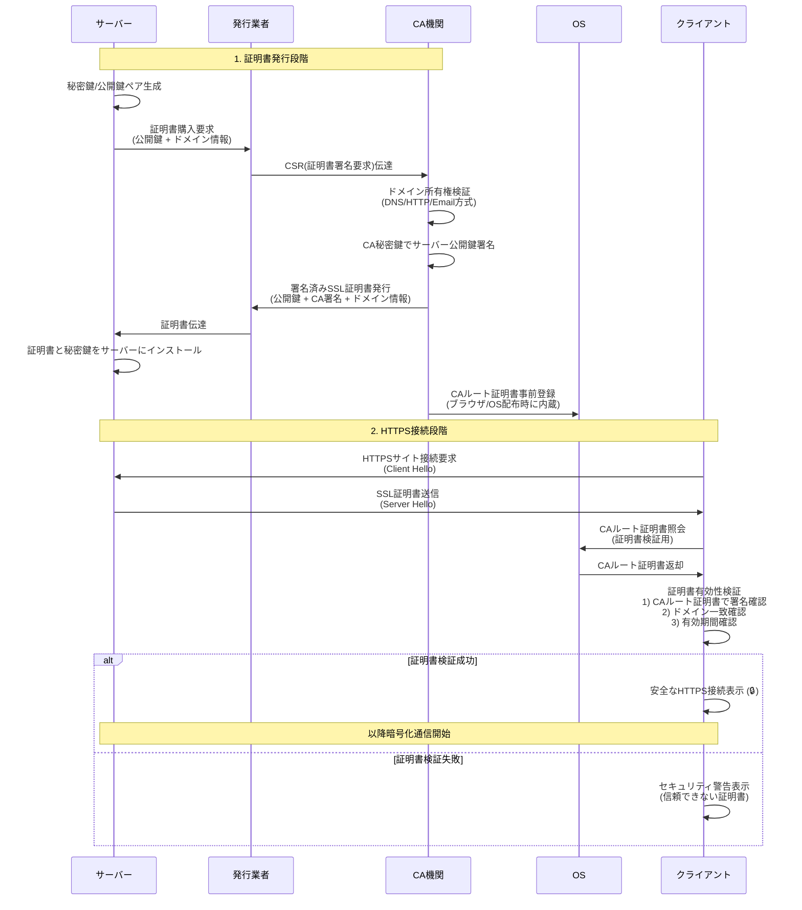

## 概要

HTTPS通信のためにTLS/SSL証明書とドメインが必要です。

所有するドメインに対して発行され、クライアントは接続したドメインと証明書のドメインが一致するかを検証します。

この文書は、実務観点からドメイン別証明書発行方法を整理します。

理論よりも実務的な選択と実装に焦点を置きます。

## SSL証明書発行および検証フロー

**核心ポイント**

- **CA機関の役割**: サーバーの公開鍵を検証して署名し、信頼性を保証
- **発行業者の役割**: サーバーとCA機関の間で証明書発行手順を仲介
- **OSの役割**: CAルート証明書を事前に内蔵し、クライアントがサーバー証明書検証に使用
- **クライアントの役割**: OSに内蔵されたCAルート証明書でサーバー証明書の署名を検証し、信頼性を確認

## TLS/SSL証明書とは

ウェブでHTTPをHTTPSに転換するために必要なデジタル証明書です。サーバーで秘密鍵を生成し

ブラウザに登録された公認CA機関のルート証明書で署名を受けます。

サーバーは秘密鍵を保管し、クライアントは公開鍵を受け取ってCAルート機関で有効性を検証します。

技術的にはTLS 1.2、TLS 1.3が現在の標準ですが、業界では依然としてSSL証明書と表現します。

この文書でも以降SSLと表記します。

## HTTPSが必要な理由

HTTPプロトコルで送信されるパスワード、カード番号などの機密情報はネットワーク上に露出します。

HTTPSはSSLプロトコルによる暗号化で第三者が送信内容を閲覧できないよう保護します。

### 暗号化方式

HTTPSは2つの暗号化を組み合わせます:

- **非対称鍵(公開鍵/秘密鍵)**: 初期接続時のみ対称鍵を安全に交換するために使用。セキュリティは高いがコンピューティングコストが大きい
- **対称鍵**: 初期交換後の実際のデータ通信に使用。コンピューティングコストが少なく高速で効率的

### HTTPSが不要な場合

機密情報がなく、中間傍受のリスクがない場合、HTTPSは必要ありません。

しかし、自己署名証明書(Self-Signed Certificate)を使用すると、ブラウザが信頼できないと警告します。

クライアントOSの証明書ストアに登録されたCAルート証明書で検証されないためです。

## 証明書発行方法

### 1. 有料証明書購入

公認証明書販売機関から購入します。販売機関がCAルート証明書機関への公開鍵登録を代行し、CA情報が記録された証明書を提供します。

**価格および有効期間**

- 証明書の種類(DV/OV/EV)、補償範囲、ドメインタイプ(単一/ワイルドカード)により価格差
- 購入時に1年以上の期間を選択(通常1年、2年、3年単位)
- 有料証明書にも有効期間があり、期限切れ時に再発行およびサーバー再配布が必要

### 2. クラウドインフラサービス

クラウドベースサーバーのCDNやロードバランサーサービスでドメイン認証後、制限された条件下で使用可能です。

**クラウド別サポート状況**

- AWS: ALB、CloudFrontなどでACM(AWS Certificate Manager)無料証明書を提供
- Azure: Application Gateway、Azure CDNなどでマネージド証明書を提供
- Google Cloud: Cloud Load Balancingで Google マネージド証明書を無料提供

ロードバランサーやCDNサービスを使用する場合、別途証明書購入が不要な場合が多いです。

### 3. 無料証明書

Let's Encrypt や OpenSSL を通じて任意発行可能です。

これを便利にできる代表的なサービスが [acme.sh](http://acme.sh/) です。

短所は有効期間が短く(通常3ヶ月)、スケジュールサービスによる自動更新構成が必要です。

## 有料証明書を使用する理由

### 賠償責任保険

CA機関のハッキングや発行過程の露出により個人情報が盗まれるリスクが存在します。

有料証明書は事後問題発生時に明示された金額で補償を受けられる保険の役割をします。

補償金額により証明書価格が変わります。

実際の問題発生および賠償事例は極めて稀で、発生すればCA業者が破産すると考えられます。

### 法人実体検証

OV/EV証明書は法人実体、事業者登録、住所、担当者などを確認する規制/監査用途で使用されます。

## 無料証明書を使用する場合

- 特定インフラ環境でHTTPSアドレスが必要だが賠償責任や費用支払いが不要な場合
- パスワードや個人情報を暗号化する必要があるが内部サーバーなので賠償責任が不要な場合
- gRPCのようなHTTPS付加機能を使用し、信頼できない証明書エラーを解決するための場合
- 開発サーバーまたはプロトタイプ段階で不要な時

## 無料証明書の短所

- 通常3ヶ月ごとに更新が必要
- Crontabやスケジュールサービスで自動更新構成が必要
- 発行手順により難易度が存在(代表的な無料発行サービス [acme.sh](http://acme.sh/) 推奨)

## 選択基準

**開発環境**: 無料証明書使用

**プロダクション環境**: 適正価格帯の有料証明書購入を推奨

## 実際の構成戦略

### クラウド環境優先活用

クラウドインフラを使用中であれば、有料証明書購入よりクラウド提供証明書を優先検討します。

AWS ACM、Azure マネージド証明書、GCP マネージド証明書は無料で自動更新され、ロードバランサー/CDNとの統合が容易です。

クラウド証明書で充足されない場合のみ有料証明書を検討します。

### 終端ポイント最小化

クライアントに露出される最初のエンドポイントサーバー(ALB、Nginxなど)にのみSSL証明書を適用し

内部リバースプロキシ区間はHTTPで通信する方式を推奨します。

**長所**

- 証明書交換時の配布ポイント最小化
- 内部サーバーは証明書管理不要
- 運用複雑度減少
