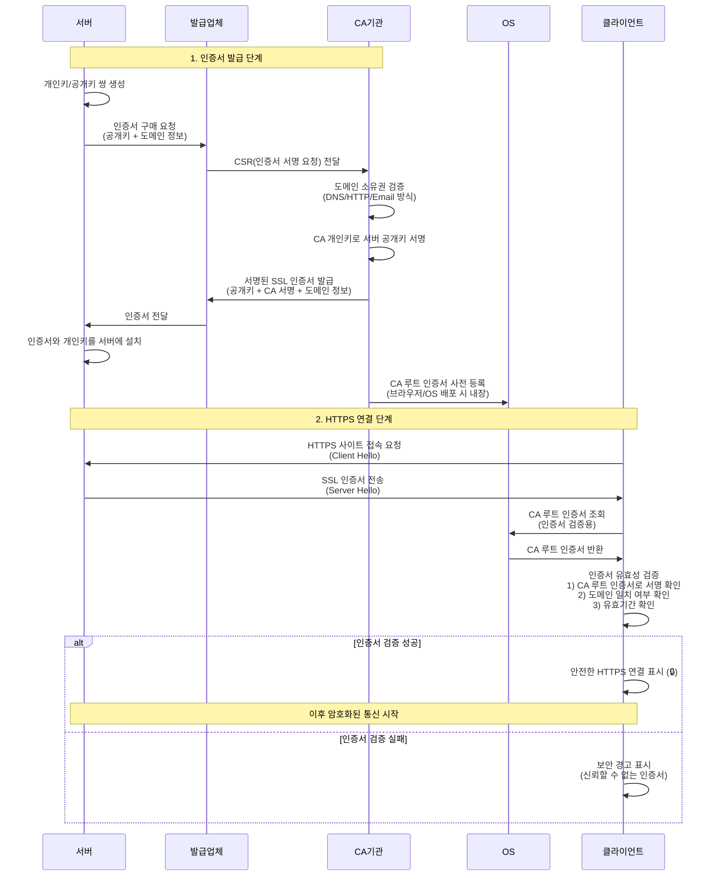

## 개요

HTTPS 통신을 위해 TLS/SSL 인증서와 도메인이 필요하다. 

소유한 도메인에 대해 발급되며 클라이언트는 접속한 도메인과 인증서의 도메인이 일치하는지 검증한다. 

이 문서는 실무 관점에서 도메인별 인증서 발급 방법을 정리한다. 

이론보다는 실무적 선택과 구현에 초점을 둔다.

## SSL 인증서 발급 및 검증 흐름

**핵심 포인트**

- **CA 기관의 역할**: 서버의 공개키를 검증하고 서명하여 신뢰성 보장
- **발급업체의 역할**: 서버와 CA 기관 사이에서 인증서 발급 절차를 중개
- **OS의 역할**: CA 루트 인증서를 사전 내장하여 클라이언트가 서버 인증서 검증에 사용
- **클라이언트의 역할**: OS에 내장된 CA 루트 인증서로 서버 인증서의 서명을 검증하고 신뢰성 확인

## TLS/SSL 인증서란

웹에서 HTTP를 HTTPS로 전환하기 위해 필요한 디지털 인증서다. 서버에서 개인키를 생성하고

브라우저에 등록된 공인 CA 기관의 루트 인증서로 서명받는다. 

서버는 개인키를 보관하고 클라이언트는 공개키를 받아 CA 루트 기관에서 유효성을 검증한다.

기술적으로는 TLS 1.2, TLS 1.3이 현재 표준이지만, 업계에서는 여전히 SSL 인증서라고 표현한다. 

이 문서에서도 이후 SSL로 표기한다.

## HTTPS가 필요한 이유

HTTP 프로토콜로 전송되는 비밀번호, 카드번호 등의 민감 정보는 네트워크 상에 노출된다. 

HTTPS는 SSL 프로토콜을 통한 암호화로 제3자가 전송 내용을 열람할 수 없게 보호한다.

### 암호화 방식

HTTPS는 두 가지 암호화를 조합한다.

- **비대칭키(공개키/개인키)**: 초기 연결 시에만 대칭키를 안전하게 교환하기 위해 사용. 보안성은 높지만 컴퓨팅 비용이 큼
- **대칭키**: 초기 교환 후 실제 데이터 통신에 사용. 컴퓨팅 비용이 적어 빠르고 효율적

### HTTPS가 필요 없는 경우

민감 정보가 없고 중간 가로채기 위험이 없다면 HTTPS는 필요하지 않다. 

하지만 자체 서명 인증서(Self-Signed Certificate)를 사용하면 브라우저가 신뢰할 수 없다고 경고한다. 

클라이언트 OS의 인증서 스토어에 등록된 CA 루트 인증서로 검증되지 않기 때문이다.

## 인증서 발급 방법

### 1. 유료 인증서 구매

공인 인증서 판매 기관에서 구매한다. 판매 기관이 CA 루트 인증서 기관에 공개키 등록을 대행하고 CA 정보가 기록된 인증서를 전달한다.

**가격 및 유효기간**

- 인증서 종류(DV/OV/EV), 배상 범위, 도메인 타입(단일/와일드카드)에 따라 가격 차등
- 구매 시 1년 이상 기간 선택 (보통 1년, 2년, 3년 단위)
- 유료 인증서도 만료 기간이 있어 만료 시 재발급 및 서버 재배포 필요

### 2. 클라우드 인프라 서비스

클라우드 기반 서버의 CDN이나 로드밸런서 서비스에서 도메인 인증 후 제한된 조건 하에 사용 가능하다.

**클라우드별 지원 현황**

- AWS: ALB, CloudFront 등에서 ACM(AWS Certificate Manager) 무료 인증서 제공
- Azure: Application Gateway, Azure CDN 등에서 관리형 인증서 제공
- Google Cloud: Cloud Load Balancing에서 Google 관리형 인증서 무료 제공

로드밸런서나 CDN 서비스를 사용한다면 별도 인증서 구매가 불필요한 경우가 많다.

### 3. 무료 인증서

Let's Encrypt 나 OpenSSL 을 통해 임의 발급 가능하다. 

그리고 이를 편리하게 할수 있는 대표적인 서비스가 [acme.sh](http://acme.sh/) 이다. 

단점은 만료 기간이 짧아(보통 3개월) 스케줄 서비스를 통한 자동 갱신 구성이 필요하다.

## 유료 인증서를 사용하는 이유

### 배상 책임 보험

CA 기관 해킹이나 발급 과정 노출로 개인정보가 탈취될 위험이 존재한다. 

유료 인증서는 사후 문제 발생 시 명시된 금액으로 보상받을 수 있는 보험 역할을 한다. 

보상 금액에 따라 인증서 가격이 달라진다.

실제 문제 발생 및 배상 사례는 극히 드물고 발생하면 CA 업체가 파산한다고 보면 된다.

### 법인 실체 검증

OV/EV 인증서는 법인 실체, 사업자 등록, 주소, 담당자 등을 확인하는 규제/감사 용도로 사용된다.

## 무료 인증서를 사용하는 경우

- 특정 인프라 환경에서 HTTPS 주소가 필요하지만 배상 책임이나 비용 지불이 불필요한 경우
- 비밀번호나 개인정보를 암호화해야 하지만 내부 서버라 배상 책임이 필요 없는 경우
- gRPC 같은 HTTPS 부가 기능을 사용하고 신뢰할 수 없는 인증서 오류를 해결하기 위한 경우
- 개발서버 또는 프로토타입 단계라서 필요 없을 때

## 무료 인증서의 단점

- 보통 3개월마다 갱신 필요
- Crontab이나 스케줄 서비스로 자동 갱신 구성 필요
- 발급 절차에 따라 난이도 존재 (대표적인 무료 발급 서비스 [acme.sh](http://acme.sh/) 추천)

## 선택 기준

**개발 환경**: 무료 인증서 사용

**프로덕션 환경**: 적정 가격대의 유료 인증서 구매 권장

## 실제 구성 전략

### 클라우드 환경 우선 활용

클라우드 인프라를 사용 중이라면 유료 인증서 구매보다 클라우드 제공 인증서를 우선 검토한다.

AWS ACM, Azure 관리형 인증서, GCP 관리형 인증서는 무료이며 자동 갱신되고 로드밸런서/CDN과 통합이 쉽다.

클라우드 인증서로 충족되지 않는 경우에만 유료 인증서를 고려한다.

### 종단 지점 최소화

클라이언트에 노출되는 첫 번째 엔드포인트 서버(ALB, Nginx 등)에만 SSL 인증서를 적용하고

내부 리버스 프록시 구간은 HTTP로 통신하는 방식을 권장한다.

**장점**

- 인증서 교체 시 배포 포인트 최소화
- 내부 서버는 인증서 관리 불필요
- 운영 복잡도 감소
