**1. 반드시 비밀번호가 설정 되어 있어야 합니다.**


이 때 비밀번호 정책은 아래와 같은 내용을 준수 해야 합니다.


시작 -> 실행 -> secpol.msc (또는 제어판 -> 관리도구 -> 로컬 보안 정책)


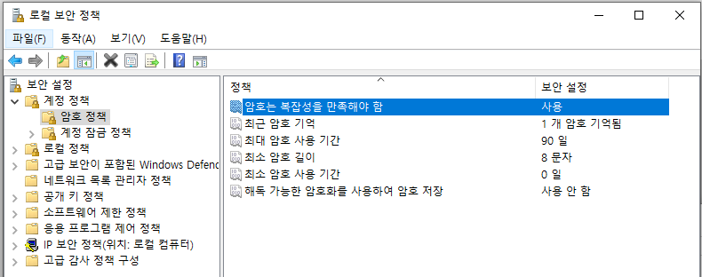


**다음과 같은 설정이 활성화 되어 있어야 합니다.**

- **암호는 복잡성을 만족해야 함 : 사용**
- **최근 암호 기억 : 1**
- **최대 암호 사용기간 : 90일**
- **최소 암호 길이 : 8문자**
- 최소 암호 사용 기간 : 기본값(=0일)
- 해독 가능한 암호화를 사용하여 암호 저장 : 기본값(=사용 안함)

**위와 같이 설정 한 경우 아래와 같이 복잡한 비밀번호 규칙을 따르게 됩니다.**


비밀번호 설정 할 때 참고 바랍니다.


```plain text
사용자의 계정 이름이나 연속되는 문자 2개를 초과하는 사용자 전체 이름의 일부를 포함하지 않음
길이가 최소한 6자 이상이어야 함
다음 네 가지 범주 중 세 가지의 문자를 포함해야 함
영문 대문자(A - Z)
영문 소문자(a - z)
기본 10개 숫자(0 - 9)
알파벳 이외의 문자(예: !, $, #, %)
복잡성 요구 사항은 암호를 변경하거나 만들 때 적용됩니다
```


**그리고 "최대 암호 사용기간 : 90일" 옵션으로 인해 마지막 비밀번호 변경 이후 90일이 지나면**


**최초 로그인시에 새 비밀번호를 입력하라고 안내 됩니다.**


---


**2. 감사 정책**


로컬 보안 정책(secpol.msc)의 [로컬 정책]-[감사 정책]을 활성화 합니다.


아래와 같이 5가지의 설정을 성공에 대해서만 감사를 활성화 합니다.


각 항목을 선택 하여 성공 부분만 체크 하고 확인 눌러서 저장 하면 됩니다.

- 계정 관리 감사 : 성공
- 계정 로그온 이벤트 감사 : 성공
- 로그온 이벤트 감사 : 성공
- 시스템 이벤트 감사 : 성공
- 정책 변경 감사 : 성공

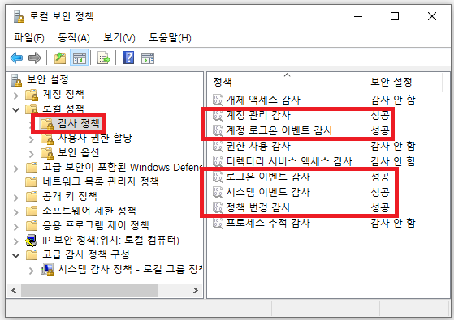


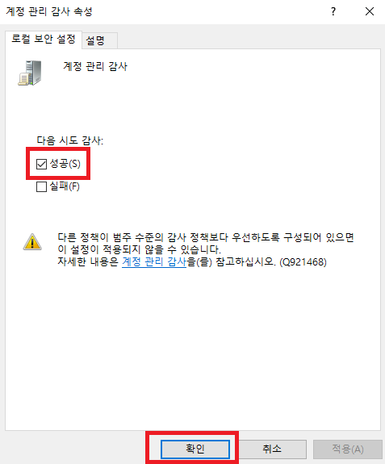


---


**3. 비밀번호는 90일 마다 변경 해야 합니다.**


**체크 방법 !! : 마지막 변경 일자 확인 하는 법**


시작 -> 실행 -> CMD(명령 프롬프트)


whoami : 내 로그인 계정 확인


net user 내계정


아래 내용 중에 마지막으로 암호 설정한 날짜가 너무 오래 되면 안 됩니다.


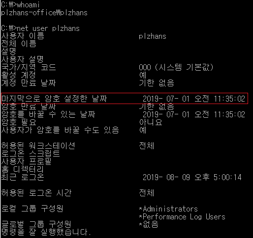


---


**4. guest 계정은 비활성화 되어 있어야 합니다.**

1. 제어판 -> 관리도구 -> 컴퓨터 관리 이
2. [시스템 도구 ]-[로컬 사용자 및 그룹]-[사용자] 이동
3. Guest 사용 안함

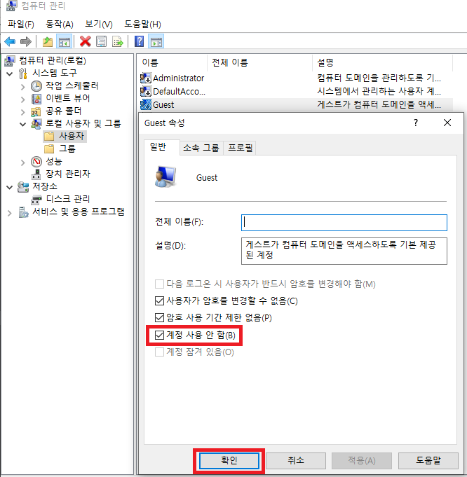


---


**5. 화면 보호기 해제 할때 비밀번호를 사용 해야 합니다.**

1. 바탕 화면 마우스 오른쪽 클릭 -> 개인 설정 이동
2. 잠금 화면 -> 화면 보호기
3. 대기 10분, 다시 시작 할 때 로그온 화면 표시 체크 !!

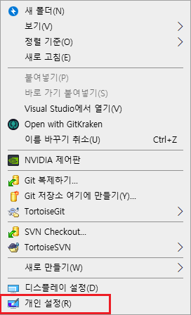


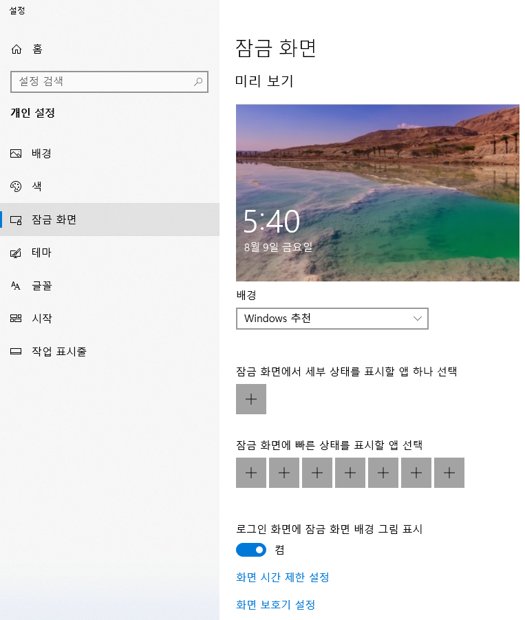


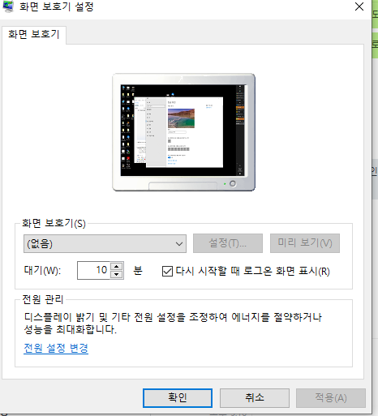


---


**6. 불필요한 드라이브 또는 폴더가 공유 되면 안됩니다.**


[시작] -> [실행] -> compmgmt.msc


( 또는 [시작]-> [실행] -> fsmgmt.msc )


아래와 같이 기본 공유가 있는것이 확인 되었습니다.


CMD 명령어를 통해서 해제 가능합니다.


(반드시 관리자 모드로 실행!)


명령어 net share 공유이름 /delete


하지만 위 방법은 재부팅 하면 공유 폴더가 다시 나타나네요.


보안상 IPC를 제외하고는 다 삭제 하는것이 좋다고 합니다.


아래 블로그를 참조 하여 레지스트리를 수정하면 재부팅 후에도 삭제 되어 있습니다.


[https://mastmanban.tistory.com/941](https://mastmanban.tistory.com/941)


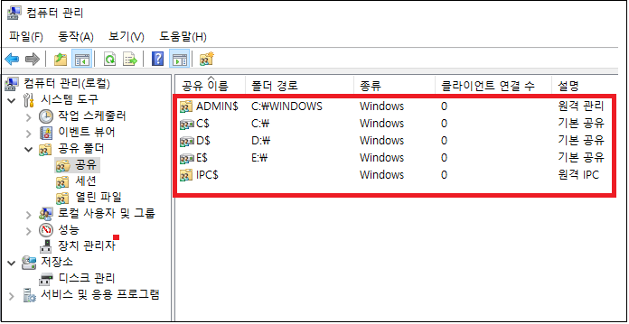


당장 설정 해제 하기


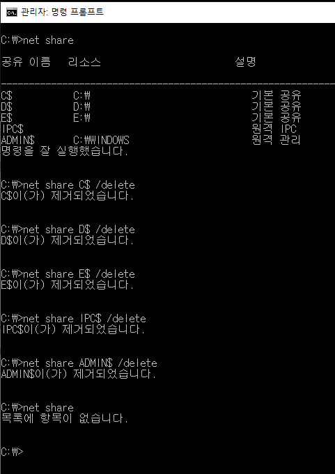


삭제 확인


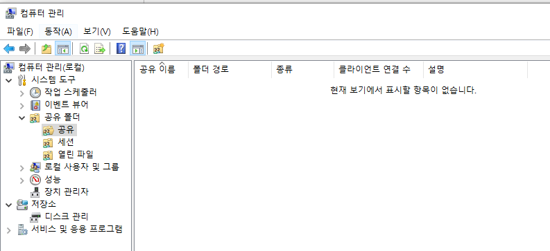


---


**7. 휴대용자동매체(USB) 자동 실행 안되게 막기**


[설정] -> [장치] 이동 : 자동실행 => 끔


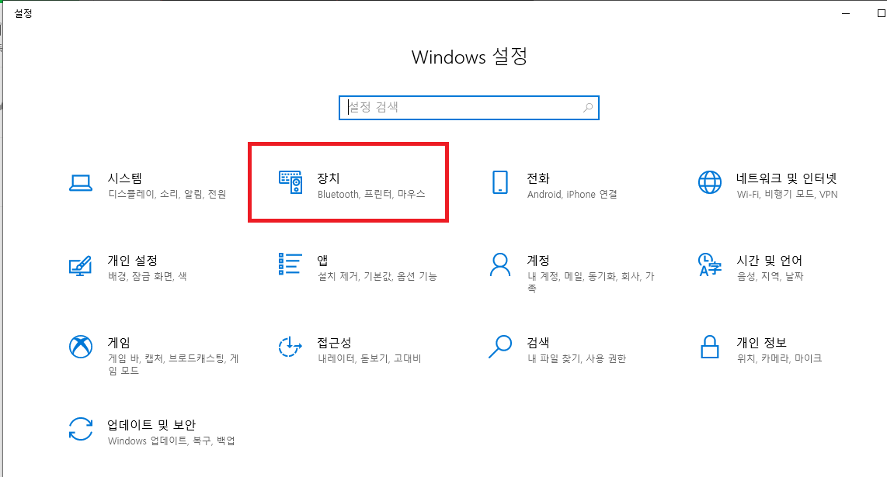


---


**8. 윈도우 업데이트**


윈도우는 항상 최신 업데이트 상태를 유지 해야 합니다.


업데이트 확인 명령어 : ms-settings:windowsupdate


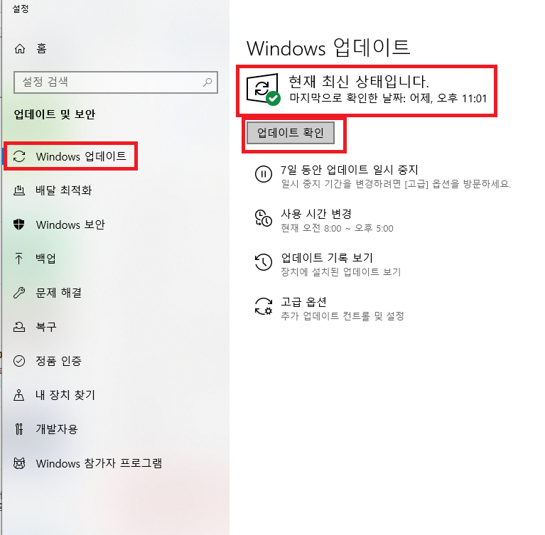


---

